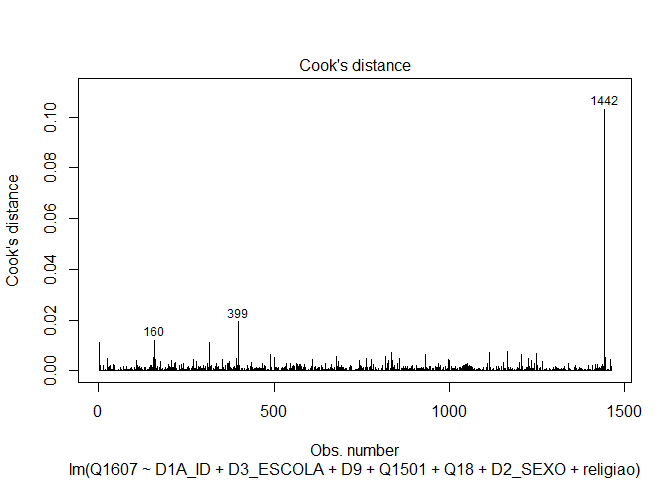

Exercicio 11 - Análise de Dados
================
Felipe Lira Paiva

``` r
library(tidyverse)
library(haven)

link <- "https://github.com/MartinsRodrigo/Analise-de-dados/blob/master/04622.sav?raw=true"

download.file(link, "04622.sav", mode = "wb")

banco <- read_spss("04622.sav") 

banco <- banco %>%
  mutate(D10 = as_factor(D10)) %>%
  filter(Q1607 < 11, 
         Q18 < 11,
         D9 < 9999998,
         Q1501 < 11)


Outras <- levels(banco$D10)[-c(3,5,13)]

banco <- banco %>%
  mutate(religiao = case_when(D10 %in% Outras ~ "Outras",
                              D10 == "Católica" ~ "Católica",
                              D10 == "Evangélica" ~ "Evangélica",
                              D10 == "Não tem religião" ~ "Não tem religião"))
```

#### Questão 1

Faça uma regressão linear avaliando em que medida as variáveis
independentes utilizadas nos exercícios 7 e 8, idade(D1A\_ID), educação
(D3\_ESCOLA), renda (D9), nota atribuída ao PT (Q1501), auto-atribuição
ideológica (Q18), sexo (D2\_SEXO) e religião (variável criada no passo
anterior) explicam a avaliação de Bolsonaro (Q1607)

``` r
reg1 <- lm(Q1607 ~ D1A_ID + D3_ESCOLA + D9 + Q1501 + Q18 + D2_SEXO + religiao, data = banco)

summary(reg1)
```

    ## 
    ## Call:
    ## lm(formula = Q1607 ~ D1A_ID + D3_ESCOLA + D9 + Q1501 + Q18 + 
    ##     D2_SEXO + religiao, data = banco)
    ## 
    ## Residuals:
    ##     Min      1Q  Median      3Q     Max 
    ## -9.0608 -2.5654  0.4179  2.3268  8.9954 
    ## 
    ## Coefficients:
    ##                            Estimate Std. Error t value Pr(>|t|)    
    ## (Intercept)               6.216e+00  5.365e-01  11.586  < 2e-16 ***
    ## D1A_ID                    1.040e-02  6.234e-03   1.669 0.095376 .  
    ## D3_ESCOLA                -1.116e-01  4.486e-02  -2.487 0.012982 *  
    ## D9                       -3.620e-05  2.764e-05  -1.309 0.190576    
    ## Q1501                    -3.946e-01  2.367e-02 -16.670  < 2e-16 ***
    ## Q18                       3.161e-01  2.603e-02  12.142  < 2e-16 ***
    ## D2_SEXO                  -6.874e-01  1.746e-01  -3.937 8.63e-05 ***
    ## religiaoEvangélica        6.685e-01  1.984e-01   3.370 0.000772 ***
    ## religiaoNão tem religião -7.565e-02  3.485e-01  -0.217 0.828177    
    ## religiaoOutras           -8.326e-01  3.081e-01  -2.702 0.006963 ** 
    ## ---
    ## Signif. codes:  0 '***' 0.001 '**' 0.01 '*' 0.05 '.' 0.1 ' ' 1
    ## 
    ## Residual standard error: 3.296 on 1452 degrees of freedom
    ## Multiple R-squared:  0.3018, Adjusted R-squared:  0.2975 
    ## F-statistic: 69.75 on 9 and 1452 DF,  p-value: < 2.2e-16

#### Questão 2

Faça o teste de homoscedasticidade do modelo e corrija as estimações dos
coeficientes caso seja necessário.

Primeiro, testes e interpretação:

``` r
library(lmtest)
library(car)


plot(reg1, 3)
```

<!-- -->

``` r
plot(reg1, 1)
```

<!-- -->

``` r
bptest(reg1)
```

    ## 
    ##  studentized Breusch-Pagan test
    ## 
    ## data:  reg1
    ## BP = 65.763, df = 9, p-value = 1.025e-10

``` r
ncvTest(reg1) 
```

    ## Non-constant Variance Score Test 
    ## Variance formula: ~ fitted.values 
    ## Chisquare = 22.48512, Df = 1, p = 2.1178e-06

Interpretação:

1.  Em “Scale-Location”, nós deveríamos observar uma distribuição de
    pontos de maneira uniforme, de cima para baixo e ao longo de todo o
    eixo x. Conseguimos ver que não está bem assim: a distribuição não é
    uniforme.
2.  Em “Residuals vs Fitted”, a linha vermelha deve ser bastante
    horizontal e os pontos devem estar igualmente distribuídos.
    Observamos claramente que os pontos não estão bem distribuídos ao
    longo da linha: há alguns padrões (linhas diagonais).
3.  Com os dois testes, nós podemos dar o veredito melhor. Como a
    hipótese nula é a presença de homocedasticidade, nós queremos um
    p-valor ALTO para não reiejitar a hipótese nula. Observamos,
    entretanto, que os p-valores dos testes são extremamente baixos.
    Necessitamos, portanto, corrigir.

Agora, a correção:

``` r
library(sandwich)

coeftest(reg1, 
         vcov = vcovHC(reg1, type = "HC3"))
```

    ## 
    ## t test of coefficients:
    ## 
    ##                             Estimate  Std. Error  t value  Pr(>|t|)    
    ## (Intercept)               6.2160e+00  5.4715e-01  11.3607 < 2.2e-16 ***
    ## D1A_ID                    1.0403e-02  6.2657e-03   1.6603 0.0970600 .  
    ## D3_ESCOLA                -1.1159e-01  4.7247e-02  -2.3619 0.0183123 *  
    ## D9                       -3.6198e-05  3.6481e-05  -0.9922 0.3212463    
    ## Q1501                    -3.9464e-01  2.6381e-02 -14.9593 < 2.2e-16 ***
    ## Q18                       3.1608e-01  2.8534e-02  11.0772 < 2.2e-16 ***
    ## D2_SEXO                  -6.8736e-01  1.7967e-01  -3.8256 0.0001360 ***
    ## religiaoEvangélica        6.6854e-01  1.9676e-01   3.3978 0.0006978 ***
    ## religiaoNão tem religião -7.5647e-02  3.7488e-01  -0.2018 0.8401094    
    ## religiaoOutras           -8.3256e-01  3.0592e-01  -2.7215 0.0065759 ** 
    ## ---
    ## Signif. codes:  0 '***' 0.001 '**' 0.01 '*' 0.05 '.' 0.1 ' ' 1

#### Questão 3

Avalie a multicolinearidade entre as variáveis

``` r
vif(reg1)
```

    ##               GVIF Df GVIF^(1/(2*Df))
    ## D1A_ID    1.219401  1        1.104265
    ## D3_ESCOLA 1.337368  1        1.156446
    ## D9        1.094849  1        1.046350
    ## Q1501     1.119818  1        1.058215
    ## Q18       1.049195  1        1.024302
    ## D2_SEXO   1.023001  1        1.011435
    ## religiao  1.093846  3        1.015062

RESPOSTA:

Como vimos, quando não há multicolinariedade, o valor mínimo é 1. Como
os valores são praticamente 1 (e estão longe de 4 e 10), podemos dizer
que não temos problemas de multicolinariedade.

#### Questão 4

Verifique a presença de outilier ou observações influentes no modelo

``` r
plot(reg1, 4)
```

<!-- -->

``` r
plot(reg1, 5)
```

<!-- -->

RESPOSTA:

Há, pelo menos, um grande outlier. Iremos tirá-lo no passo seguinte.

#### Questão 5

Faça a regressao linear sem a observação mais influente e avalie a
alteração do resultado

``` r
banco2 <- banco %>%
  filter(A1_Nquest != 2460)


reg2 <- lm(Q1607 ~ D1A_ID + D3_ESCOLA + D9 + Q1501 + Q18 + D2_SEXO + religiao, data = banco2)

summary(reg2)
```

    ## 
    ## Call:
    ## lm(formula = Q1607 ~ D1A_ID + D3_ESCOLA + D9 + Q1501 + Q18 + 
    ##     D2_SEXO + religiao, data = banco2)
    ## 
    ## Residuals:
    ##     Min      1Q  Median      3Q     Max 
    ## -9.1171 -2.4749  0.3718  2.3110  8.9899 
    ## 
    ## Coefficients:
    ##                            Estimate Std. Error t value Pr(>|t|)    
    ## (Intercept)               6.240e+00  5.360e-01  11.640  < 2e-16 ***
    ## D1A_ID                    1.133e-02  6.243e-03   1.814 0.069827 .  
    ## D3_ESCOLA                -1.022e-01  4.504e-02  -2.268 0.023446 *  
    ## D9                       -6.396e-05  3.071e-05  -2.083 0.037444 *  
    ## Q1501                    -3.975e-01  2.369e-02 -16.781  < 2e-16 ***
    ## Q18                       3.157e-01  2.600e-02  12.139  < 2e-16 ***
    ## D2_SEXO                  -7.080e-01  1.747e-01  -4.053 5.31e-05 ***
    ## religiaoEvangélica        6.807e-01  1.983e-01   3.433 0.000613 ***
    ## religiaoNão tem religião -6.671e-02  3.481e-01  -0.192 0.848065    
    ## religiaoOutras           -8.193e-01  3.078e-01  -2.662 0.007855 ** 
    ## ---
    ## Signif. codes:  0 '***' 0.001 '**' 0.01 '*' 0.05 '.' 0.1 ' ' 1
    ## 
    ## Residual standard error: 3.292 on 1451 degrees of freedom
    ## Multiple R-squared:  0.3037, Adjusted R-squared:  0.2994 
    ## F-statistic: 70.32 on 9 and 1451 DF,  p-value: < 2.2e-16

``` r
plot(reg2, 4)
```

<!-- -->

``` r
plot(reg2, 5)
```

<!-- -->

RESPOSTAS:

1.  Uma das principais alterações foi com a variável de renda (`D9`): Na
    primeira regressão, não era significativo, mas, sem o outlier, está
    significativo (p-valor \< 0.05). O coeficiente é pequeno (-6.396^5;
    o outro também era pequeno) e a direção continuou a mesma (relação
    negativa, quanto maior a renda, menor o apreço a Bolsonaro).
    Lembramos que esse coeficiente ser pequeno é porque os valores de
    renda variam muito.
2.  Demais p-valores: houve mudanças neles, mas nenhuma grande o
    suficente para mudar a significância (ou sua falta) em relação à
    primeira regressão.
3.  Houve mudanças nos coeficientes também. Um dos que mais mudou foi de
    gênero (`D2_SEXO`): antes era -0,6685 e, agora, foi de -0,7080. Ou
    seja, aumentou o efeito negativo (Em outras palavras, sem outlier o
    fato de ser mulher diminui o apreço a Bolsonaro).
4.  Outro coeficiente que merece ser mencionado especificamente é o de
    “não ter religião”. Ainda que o p-valor não tenha sido
    significativo nas duas regressões, notamos que o coeficiente, antes,
    era de -0,07565 e, agora, é de -0,06671 (ou seja, o impacto negativo
    diminuiu). Os demais coeficientes foram também alterados, mas foram
    mudanças menores (em casas decimais menores).
5.  O erro residual padrão não foi alterado; o r-quadrado e o r-quadrado
    ajustado foi pouco alterados (casas decimais)
