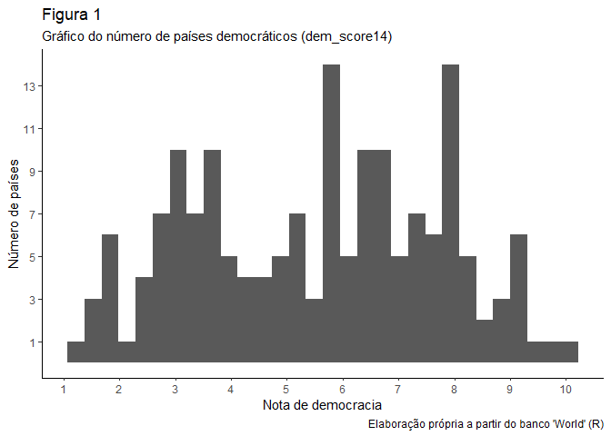
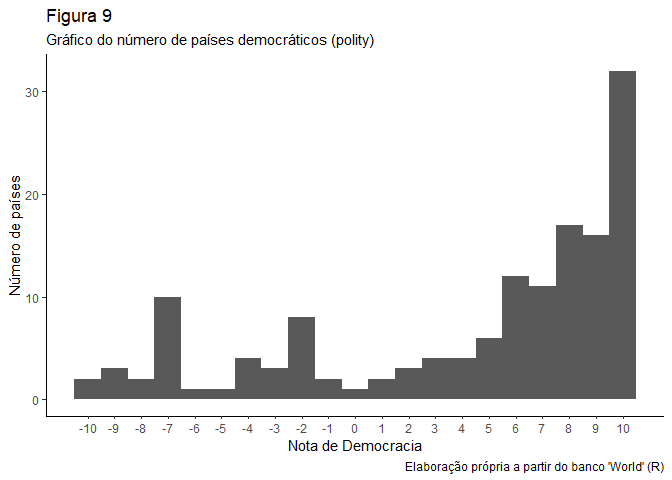
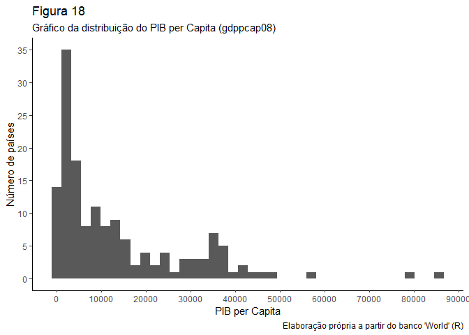
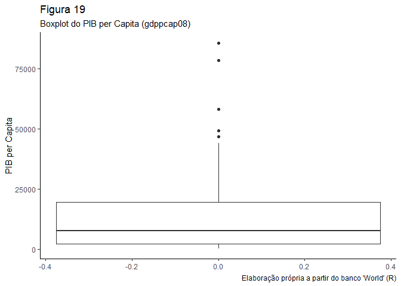
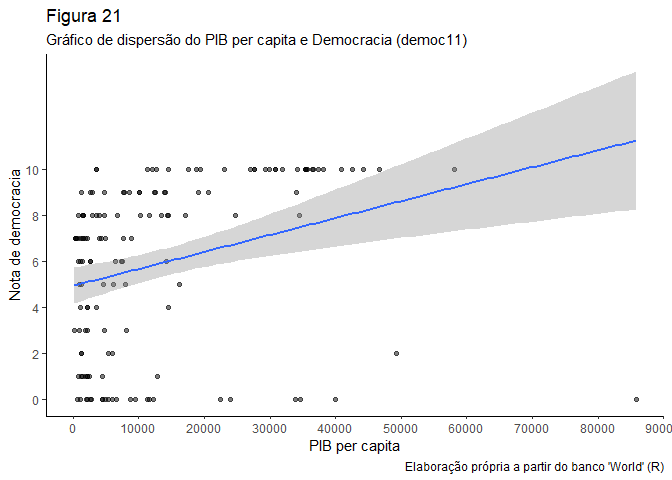

Exercício 5 - Análise de Dados
================
Felipe Lira Paiva

### Questão 1

Carregue o banco de dados `world` que está no pacote `poliscidata`.

``` r
library(poliscidata)
library(tidyverse)
library(graphics)
library(scales)
library(vcd)
library(knitr)

banco <- world
```

### Questão 2

Existem diversas medidas de democracia para os países: `dem_score14`,
`democ11`, `fhrate04_rev`, `fhrate08_rev`, `polity`. Descreva-as
graficamente e diga quais são as diferenças entre tais medidas. Para
cada variável, há um histograma e um boxplot. A resposta está após os
gráficos.

``` r
    ggplot(banco, aes(dem_score14))+
        geom_histogram(bins = 30)+
        theme_classic()+
        scale_y_continuous(breaks=seq(1,13,2))+
        scale_x_continuous(breaks=seq(1,10,1))+
        labs(title = "Figura 1",
             subtitle = "Gráfico do número de países democráticos (dem_score14)",
             x = "Nota de democracia", y = "Número de países",
             caption = "Elaboração própria a partir do banco 'World' (R)")
```

<!-- -->

``` r
 ggplot(banco, aes(y = dem_score14))+ 
        geom_boxplot()+
        theme_classic()+
        scale_y_continuous(breaks=seq(1,10,1))+
        labs(title = "Figura 2",
             subtitle = "Boxplot da nota de Democracia (dem_score14)",
             y = "Nota de Democracia",
             caption = "Elaboração própria a partir do banco 'World' (R)")
```

<!-- -->

``` r
  ggplot(banco, aes(democ11))+
        geom_histogram(binwidth = 1)+
        theme_classic()+
        scale_x_continuous(breaks=seq(0,10,1))+
        labs(title = "Figura 3",
             subtitle = "Gráfico do número de países democráticos (democ11)",
             x = "Nota de democracia", y = "Número de países",
             caption = "Elaboração própria a partir do banco 'World' (R)")
```

<!-- -->

``` r
  ggplot(banco, aes(y = democ11))+ 
        geom_boxplot()+
        theme_classic()+
        labs(title = "Figura 4",
             subtitle = "Boxplot da nota de Democracia (democ11)",
             y = "Nota de Democracia",
             caption = "Elaboração própria a partir do banco 'World' (R)") 
```

<!-- -->

``` r
  ggplot(banco, aes(fhrate04_rev))+
        geom_histogram(binwidth = 0.5)+
        theme_classic()+
        scale_x_continuous(breaks=seq(1,7,1))+
        labs(title = "Figura 5",
             subtitle = "Gráfico do número de países democráticos (fhrate04_rev)",
             x = "Nota de democracia", y = "Número de países",
             caption = "Elaboração própria a partir do banco 'World' (R)")
```

<!-- -->

``` r
  ggplot(banco, aes(y = fhrate04_rev))+ 
        geom_boxplot()+
        theme_classic()+
        labs(title = "Figura 6",
             subtitle = "Boxplot da nota de Democracia (fhrate04_rev)",
             y = "Nota de Democracia",
             caption = "Elaboração própria a partir do banco 'World' (R)")
```

<!-- -->

``` r
  ggplot(banco, aes(fhrate08_rev))+
        geom_histogram(binwidth = 1) +
        theme_classic()+
        scale_x_continuous(breaks=seq(0,12,1))+
        labs(title = "Figura 7",
             subtitle = "Gráfico do número de países democráticos (fhrate08_rev)",
             x = "Nota de democracia", y = "Número de países",
             caption = "Elaboração própria a partir do banco 'World' (R)")
```

<!-- -->

``` r
   ggplot(banco, aes(y = fhrate08_rev)) + 
         geom_boxplot()+
         theme_classic()+
         labs(title = "Figura 8",
              subtitle = "Boxplot da nota de Democracia (fhrate08_rev)",
              y = "Nota de Democracia",
              caption = "Elaboração própria a partir do banco 'World' (R)")  
```

<!-- -->

``` r
   ggplot(banco, aes(polity))+
        geom_histogram(binwidth = 1)+
        theme_classic()+
        scale_x_continuous(breaks=seq(-10,10,1))+
        labs(title = "Figura 9",
             subtitle = "Gráfico do número de países democráticos (polity)",
             x = "Nota de Democracia", y = "Número de países",
             caption = "Elaboração própria a partir do banco 'World' (R)")
```

<!-- -->

``` r
     ggplot(banco, aes(y = polity))+ 
         geom_boxplot()+
         scale_y_continuous(breaks=seq(-10,10,2))+
         theme_classic()+
         labs(title = "Figura 10",
              subtitle = "Boxplot da nota de Democracia (polity)",
              y = "Nota de Democracia",
              caption = "Elaboração própria a partir do banco 'World' (R)") 
```

<!-- -->

RESPOSTA QUESTÃO 2: Apesar de todas as variáveis serem medidas de
democracia, há diferenças entre elas. Na primeira, `dem_score`, os
países podem assumir qualquer valor (com duas casas decimais) entre 1 e
10. Tanto o histograma quanto o boxplot mostram uma grande variação dos
dados, com países nos dois extremos. A partir do boxplot percebemos,
também, que a mediana se encontra próximo de 6.

Já a variável `democ11` assume valores inteiros entre 0 e 10. Sua
mediana está próxima de 7,5 (ver boxplot). Os valores com maior
frequência são 0 e 10.

A variável `fhrate04_rev` assume valores entre 1 e 7, incluindo “.5”. As
maiores frequências são 2.5 e 7. A partir do boxplot, a mediana está
próxima de 5 e o valores entre o mínimo e o primeiro quartil variam
mais que entre o máximo e o terceiro quartil.

A variável `fhrate08_rev` assume valores entre 0 e 12. As maiores
frequências estão em 12 e 3, respectivamente. A partir do histograma,
vemos que os valores estão bem distribuídos ao longo da escala - com
quase todos com números parecidos. A partir do boxplot, vemos que a
mediana está um pouco abaixo de 7.5 e o valores entre o mínimo e o
primeiro quartil variam mais que entre o máximo e o terceiro quartil.

Por último, em `polity`, temos valores entre -10 e 10. As três maiores
frequências estão nos valores mais altos: 10, 8 e 9, respectivamente. A
mediana, a partir do boxplot, parece estar em aproximadamente 7.

### Questão 3

Avalie a relação entre todas as medidas de democracia e desigualdade,
utilizando a variável `gini08`. Descreva graficamente esta variável, a
relação entre as duas variáveis, meça a correlação entre elas e faça
regressões lineares (interpretando em profundidade os resultados dos
coeficientes e medidas de desempenho dos modelos). Enfatize as
semelhanças e diferenças entre os resultados. Quais são suas
conclusões?

Para ficar organizado, a correlação, o gráfico de dispersão e a
regressão de cada variável estão dispostos consecutivamente. As
análises estão após tudo, para facilitar a comparação e a correção.

``` r
ggplot(banco, aes(gini08))+
        geom_histogram(bins = 30)+
        scale_x_continuous(breaks = seq(20,80,5))+
        scale_y_continuous(breaks = seq(1,14,2))+
        theme_classic()+
        labs(title = "Figura 11",
             subtitle = "Gráfico da frequência do Coeficiente de Gini (gini08)",
             x = "Coeficiente de gini", y = "Número de países",
             caption = "Elaboração própria a partir do banco 'World' (R)")
```

<!-- -->

``` r
ggplot(banco, aes(y = gini08))+ 
        geom_boxplot()+
        theme_classic()+
        labs(title = "Figura 12",
             subtitle = "Boxplot do Coeficiente de Gini (gini08)",
             y = "Coeficiente de Gini",
             caption = "Elaboração própria a partir do banco 'World' (R)")
```

<!-- -->

##### Questão 3: Gini e Democracia (dem\_score14)

``` r
  cor.test(banco$gini08, banco$dem_score14)
```

    ## 
    ##  Pearson's product-moment correlation
    ## 
    ## data:  banco$gini08 and banco$dem_score14
    ## t = -2.4621, df = 120, p-value = 0.01523
    ## alternative hypothesis: true correlation is not equal to 0
    ## 95 percent confidence interval:
    ##  -0.38215203 -0.04321115
    ## sample estimates:
    ##        cor 
    ## -0.2192877

``` r
ggplot(banco, aes(gini08, dem_score14)) +
    geom_point()+
    geom_smooth(method = "lm")+
    theme_classic()+
    scale_x_continuous(breaks = seq(20,80,5))+
    scale_y_continuous(breaks = seq(1,10,2))+
    labs(title = "Figura 13",
         subtitle = "Gráfico de dispersão do Gini e Democracia (dem_score14)",
         x = "Coeficiente de gini", y = "Nota de democracia",
         caption = "Elaboração própria a partir do banco 'World' (R)")
```

    ## `geom_smooth()` using formula 'y ~ x'

<!-- -->

``` r
reg1 <- lm(gini08 ~ dem_score14, data = banco)
  summary(reg1)
```

    ## 
    ## Call:
    ## lm(formula = gini08 ~ dem_score14, data = banco)
    ## 
    ## Residuals:
    ##     Min      1Q  Median      3Q     Max 
    ## -15.669  -7.455  -1.785   5.316  34.010 
    ## 
    ## Coefficients:
    ##             Estimate Std. Error t value Pr(>|t|)    
    ## (Intercept)  47.0365     2.7447  17.137   <2e-16 ***
    ## dem_score14  -1.0811     0.4391  -2.462   0.0152 *  
    ## ---
    ## Signif. codes:  0 '***' 0.001 '**' 0.01 '*' 0.05 '.' 0.1 ' ' 1
    ## 
    ## Residual standard error: 9.877 on 120 degrees of freedom
    ##   (45 observations deleted due to missingness)
    ## Multiple R-squared:  0.04809,    Adjusted R-squared:  0.04015 
    ## F-statistic: 6.062 on 1 and 120 DF,  p-value: 0.01523

``` r
  confint(reg1)
```

    ##                 2.5 %     97.5 %
    ## (Intercept) 41.602244 52.4707453
    ## dem_score14 -1.950509 -0.2117234

##### Questão 3: Gini e Democracia (democ11)

``` r
  cor.test(banco$gini08, banco$democ11)
```

    ## 
    ##  Pearson's product-moment correlation
    ## 
    ## data:  banco$gini08 and banco$democ11
    ## t = -0.90439, df = 113, p-value = 0.3677
    ## alternative hypothesis: true correlation is not equal to 0
    ## 95 percent confidence interval:
    ##  -0.26378781  0.09988899
    ## sample estimates:
    ##         cor 
    ## -0.08477203

``` r
  ggplot(banco, aes(gini08, democ11))+
    geom_point(alpha = 0.5)+
    geom_smooth(method = "lm")+
    theme_classic()+
    scale_x_continuous(breaks = seq(20,80,5))+
    scale_y_continuous(breaks = seq(0,10,2))+
    labs(title = "Figura 14",
         subtitle = "Gráfico de dispersão do Gini e Democracia (democ11)",
         x = "Coeficiente de gini", y = "Nota de democracia",
         caption = "Elaboração própria a partir do banco 'World' (R)")
```

    ## `geom_smooth()` using formula 'y ~ x'

<!-- -->

``` r
  reg2 <- lm(gini08 ~ democ11, data = banco)
  summary(reg2)
```

    ## 
    ## Call:
    ## lm(formula = gini08 ~ democ11, data = banco)
    ## 
    ## Residuals:
    ##     Min      1Q  Median      3Q     Max 
    ## -15.071  -7.211  -1.731   6.059  33.569 
    ## 
    ## Coefficients:
    ##             Estimate Std. Error t value Pr(>|t|)    
    ## (Intercept)  42.1711     1.9462  21.669   <2e-16 ***
    ## democ11      -0.2400     0.2654  -0.904    0.368    
    ## ---
    ## Signif. codes:  0 '***' 0.001 '**' 0.01 '*' 0.05 '.' 0.1 ' ' 1
    ## 
    ## Residual standard error: 9.826 on 113 degrees of freedom
    ##   (52 observations deleted due to missingness)
    ## Multiple R-squared:  0.007186,   Adjusted R-squared:  -0.0016 
    ## F-statistic: 0.8179 on 1 and 113 DF,  p-value: 0.3677

``` r
  confint(reg2)
```

    ##                  2.5 %     97.5 %
    ## (Intercept) 38.3153906 46.0268212
    ## democ11     -0.7658213  0.2857752

##### Questão 3: Gini e Democracia (fhrate04\_rev)

``` r
cor.test(banco$gini08, banco$fhrate04_rev)
```

    ## 
    ##  Pearson's product-moment correlation
    ## 
    ## data:  banco$gini08 and banco$fhrate04_rev
    ## t = -1.9869, df = 120, p-value = 0.04921
    ## alternative hypothesis: true correlation is not equal to 0
    ## 95 percent confidence interval:
    ##  -0.3452745300 -0.0007294745
    ## sample estimates:
    ##        cor 
    ## -0.1784673

``` r
 ggplot(banco, aes(gini08, fhrate04_rev)) +
    geom_point()+
    geom_smooth(method = "lm")+
    theme_classic()+
    scale_x_continuous(breaks = seq(20,80,5))+
    scale_y_continuous(breaks = seq(1,7,1))+
    labs(title = "Figura 15",
         subtitle = "Gráfico de dispersão do Gini e Democracia (fhrate04_rev)",
         x = "Coeficiente de gini", y = "Nota de democracia",
         caption = "Elaboração própria a partir do banco 'World' (R)")
```

    ## `geom_smooth()` using formula 'y ~ x'

<!-- -->

``` r
 reg3 <- lm(gini08 ~ fhrate04_rev, data = banco)
  summary(reg3)
```

    ## 
    ## Call:
    ## lm(formula = gini08 ~ fhrate04_rev, data = banco)
    ## 
    ## Residuals:
    ##     Min      1Q  Median      3Q     Max 
    ## -14.782  -7.653  -2.478   5.979  34.313 
    ## 
    ## Coefficients:
    ##              Estimate Std. Error t value Pr(>|t|)    
    ## (Intercept)   45.4619     2.5854  17.584   <2e-16 ***
    ## fhrate04_rev  -0.9955     0.5010  -1.987   0.0492 *  
    ## ---
    ## Signif. codes:  0 '***' 0.001 '**' 0.01 '*' 0.05 '.' 0.1 ' ' 1
    ## 
    ## Residual standard error: 9.961 on 120 degrees of freedom
    ##   (45 observations deleted due to missingness)
    ## Multiple R-squared:  0.03185,    Adjusted R-squared:  0.02378 
    ## F-statistic: 3.948 on 1 and 120 DF,  p-value: 0.04921

``` r
  confint(reg3)
```

    ##                  2.5 %       97.5 %
    ## (Intercept)  40.342962 50.580882269
    ## fhrate04_rev -1.987536 -0.003496565

##### Questão 3: Gini e democracia (fhrate08\_rev)

``` r
  cor.test(banco$gini08, banco$fhrate08_rev)
```

    ## 
    ##  Pearson's product-moment correlation
    ## 
    ## data:  banco$gini08 and banco$fhrate08_rev
    ## t = -1.7432, df = 119, p-value = 0.08387
    ## alternative hypothesis: true correlation is not equal to 0
    ## 95 percent confidence interval:
    ##  -0.32708386  0.02129614
    ## sample estimates:
    ##        cor 
    ## -0.1578002

``` r
ggplot(banco, aes(gini08, fhrate08_rev)) +
    geom_point(alpha = 0.5)+
    geom_smooth(method = "lm")+
    theme_classic()+
    scale_x_continuous(breaks = seq(20,80,5))+
    scale_y_continuous(breaks = seq(1,14,2))+
    labs(title = "Figura 16",
         subtitle = "Gráfico de dispersão do Gini e Democracia (fhrate08_rev)",
         x = "Coeficiente de gini", y = "Nota de democracia",
         caption = "Elaboração própria a partir do banco 'World' (R)")
```

    ## `geom_smooth()` using formula 'y ~ x'

<!-- -->

``` r
  reg4 <- lm(gini08 ~ fhrate08_rev, data = banco)
  summary(reg4)
```

    ## 
    ## Call:
    ## lm(formula = gini08 ~ fhrate08_rev, data = banco)
    ## 
    ## Residuals:
    ##     Min      1Q  Median      3Q     Max 
    ## -14.728  -7.801  -2.373   6.063  34.709 
    ## 
    ## Coefficients:
    ##              Estimate Std. Error t value Pr(>|t|)    
    ## (Intercept)   44.0459     2.1692  20.305   <2e-16 ***
    ## fhrate08_rev  -0.4454     0.2555  -1.743   0.0839 .  
    ## ---
    ## Signif. codes:  0 '***' 0.001 '**' 0.01 '*' 0.05 '.' 0.1 ' ' 1
    ## 
    ## Residual standard error: 10.03 on 119 degrees of freedom
    ##   (46 observations deleted due to missingness)
    ## Multiple R-squared:  0.0249, Adjusted R-squared:  0.01671 
    ## F-statistic: 3.039 on 1 and 119 DF,  p-value: 0.08387

``` r
  confint(reg4)
```

    ##                   2.5 %      97.5 %
    ## (Intercept)  39.7506356 48.34122701
    ## fhrate08_rev -0.9514214  0.06052504

##### Questão 3: Gini e democracia (polity)

``` r
cor.test(banco$gini08, banco$polity)
```

    ## 
    ##  Pearson's product-moment correlation
    ## 
    ## data:  banco$gini08 and banco$polity
    ## t = -0.43417, df = 113, p-value = 0.665
    ## alternative hypothesis: true correlation is not equal to 0
    ## 95 percent confidence interval:
    ##  -0.2222590  0.1433725
    ## sample estimates:
    ##         cor 
    ## -0.04080936

``` r
 ggplot(banco, aes(gini08, polity)) +
    geom_point(alpha = 0.5)+
    geom_smooth(method = "lm")+
    theme_classic()+
    scale_x_continuous(breaks = seq(20,80,5))+
    scale_y_continuous(breaks = seq(-11,11,2))+
    labs(title = "Figura 17",
         subtitle = "Gráfico de dispersão do Gini e Democracia (polity)",
         x = "Coeficiente de gini", y = "Nota de democracia",
         caption = "Elaboração própria a partir do banco 'World' (R)")
```

    ## `geom_smooth()` using formula 'y ~ x'

<!-- -->

``` r
 reg5 <- lm(gini08 ~ polity, data = banco)
  summary(reg5)
```

    ## 
    ## Call:
    ## lm(formula = gini08 ~ polity, data = banco)
    ## 
    ## Residuals:
    ##     Min      1Q  Median      3Q     Max 
    ## -15.576  -7.166  -1.566   6.056  33.734 
    ## 
    ## Coefficients:
    ##             Estimate Std. Error t value Pr(>|t|)    
    ## (Intercept) 41.00234    1.27543  32.148   <2e-16 ***
    ## polity      -0.07265    0.16732  -0.434    0.665    
    ## ---
    ## Signif. codes:  0 '***' 0.001 '**' 0.01 '*' 0.05 '.' 0.1 ' ' 1
    ## 
    ## Residual standard error: 9.853 on 113 degrees of freedom
    ##   (52 observations deleted due to missingness)
    ## Multiple R-squared:  0.001665,   Adjusted R-squared:  -0.007169 
    ## F-statistic: 0.1885 on 1 and 113 DF,  p-value: 0.665

``` r
  confint(reg5)
```

    ##                  2.5 %     97.5 %
    ## (Intercept) 38.4754861 43.5291894
    ## polity      -0.4041399  0.2588477

RESPOSTAS:

1.  **Descritivos do Gini**: Tanto com o histograma quanto com o
    boxplot, é possível observarmos um outlier. A mediana está próxima
    de 40 e os valores mais frequentes estão por volta de 34 e 40.
    Importante destacar que os valores codificados não são inteiros, por
    isso o uso de palavras como “por volta” e “aproximadamente”.

2.  **Correlações**: Todas as cinco correlações possuem a direção
    negativa. Isso significa que um aumento do Gini (mais desigualdade)
    está correlacionada a uma diminuição do da democracia. Entretanto,
    nenhuma é maior que 0,22 (e duas são menos de 0,05). A relação é,
    portanto, pequena. Sobre o p-valor das correlações, ele é menor que
    0.05 em `dem_score14` e `fhrate04_rev` e maior que 0.05 em
    `democ11`, `fhrate08_rev` e `polity`. O intervalo de confiança, como
    é de se esperar, confirma isso: ele passa pelo 0 para `democ11`,
    `fhrate08_rev` e `polity`.

3.  **Regressões**: Não possui significância estatística: `democ11`,
    `fhrate08_rev` e `polity`. Os modelos dois que possuem
    (`dem_score14` e `fhrate04_rev`) estão com p-valor de 0.5. O R² de
    ambos é pequeno, ou seja, o modelo não explica muita coisa (o que
    poderia mudar com a adição de variáveis de controle, mas diria que
    dificilmente valeria o esforço, já que ambos R² são menores que 5%).
    Falamos acima, na correlação, mas não custa lembrar que a direção é
    negativa (sinal do coeficiente).

4.  **Intervalo de confiança**: O coeficiente está dentro do intervalo
    de confiança, que não passa pelo zero (apenas para os modelos de
    `dem_score14` e `fhrate04_rev`)

### Questão 4

Avalie a relação entre todas as medidas de democracia e crescimento
econômico, utilizando a variável `gdppcap08`. Descreva graficamente
esta variável, a relação entre as duas variáveis, meça a correlação
entre elas e faça regressões lineares (interpretando em profundidade os
resultados dos coeficientes e medidas de desempenho dos modelos).
Enfatize as semelhanças e diferenças entre os resultados. Quais são suas
conclusões?

Para ficar organizado, a correlação, o gráfico de dispersão e a
regressão de cada variável estão dispostos consecutivamente. As
análises estão após tudo, para facilitar a comparação e a correção.

``` r
 ggplot(banco, aes(gdppcap08))+
    geom_histogram(bins = 40)+
    scale_x_continuous(breaks = seq(0,100000,10000))+
    scale_y_continuous(breaks = seq(0,35,5))+
    theme_classic()+
    labs(title = "Figura 18",
         subtitle = "Gráfico da distribuição do PIB per Capita (gdppcap08)",
         x = "PIB per Capita", y = "Número de países",
         caption = "Elaboração própria a partir do banco 'World' (R)")
```

<!-- -->

``` r
ggplot(banco, aes(y = gdppcap08))+ 
        geom_boxplot()+
        theme_classic()+
        labs(title = "Figura 19",
             subtitle = "Boxplot do PIB per Capita (gdppcap08)",
             y = "PIB per Capita",
             caption = "Elaboração própria a partir do banco 'World' (R)")
```

<!-- -->

##### Questão 4: PIB per capita e Democracia (dem\_score14)

``` r
  cor.test(banco$gdppcap08, banco$dem_score14)
```

    ## 
    ##  Pearson's product-moment correlation
    ## 
    ## data:  banco$gdppcap08 and banco$dem_score14
    ## t = 7.1713, df = 150, p-value = 3.159e-11
    ## alternative hypothesis: true correlation is not equal to 0
    ## 95 percent confidence interval:
    ##  0.3763618 0.6150148
    ## sample estimates:
    ##       cor 
    ## 0.5052872

``` r
  ggplot(banco, aes(gdppcap08, dem_score14)) +
    geom_point()+
    geom_smooth(method = "lm")+
    theme_classic()+
    scale_x_continuous(breaks = seq(0,90000,10000))+
    scale_y_continuous(breaks = seq(1,15,2))+
    labs(title = "Figura 20",
         subtitle = "Gráfico de dispersão do PIB per capita e Democracia (dem_score14)",
         x = "PIB per capita", y = "Nota de democracia",
         caption = "Elaboração própria a partir do banco 'World' (R)")
```

    ## `geom_smooth()` using formula 'y ~ x'

<!-- -->

``` r
  reg6 <- lm(gdppcap08 ~ dem_score14, data = banco)
  summary(reg6)
```

    ## 
    ## Call:
    ## lm(formula = gdppcap08 ~ dem_score14, data = banco)
    ## 
    ## Residuals:
    ##    Min     1Q Median     3Q    Max 
    ## -18910  -9211  -2880   5955  81177 
    ## 
    ## Coefficients:
    ##             Estimate Std. Error t value Pr(>|t|)    
    ## (Intercept)  -6841.9     3049.3  -2.244   0.0263 *  
    ## dem_score14   3626.7      505.7   7.171 3.16e-11 ***
    ## ---
    ## Signif. codes:  0 '***' 0.001 '**' 0.01 '*' 0.05 '.' 0.1 ' ' 1
    ## 
    ## Residual standard error: 13380 on 150 degrees of freedom
    ##   (15 observations deleted due to missingness)
    ## Multiple R-squared:  0.2553, Adjusted R-squared:  0.2504 
    ## F-statistic: 51.43 on 1 and 150 DF,  p-value: 3.159e-11

``` r
  confint(reg6)
```

    ##                  2.5 %    97.5 %
    ## (Intercept) -12867.095 -816.7024
    ## dem_score14   2627.464 4626.0129

##### Questão 4: PIB per capita e Democracia (democ11)

``` r
  cor.test(banco$gdppcap08, banco$democ11)
```

    ## 
    ##  Pearson's product-moment correlation
    ## 
    ## data:  banco$gdppcap08 and banco$democ11
    ## t = 3.6037, df = 140, p-value = 0.000435
    ## alternative hypothesis: true correlation is not equal to 0
    ## 95 percent confidence interval:
    ##  0.1330147 0.4351981
    ## sample estimates:
    ##      cor 
    ## 0.291358

``` r
 ggplot(banco, aes(gdppcap08, democ11)) +
    geom_point(alpha = 0.5)+
    geom_smooth(method = "lm")+
    theme_classic()+
    scale_x_continuous(breaks = seq(0,90000,10000))+
    scale_y_continuous(breaks = seq(0,10,2))+
    labs(title = "Figura 21",
         subtitle = "Gráfico de dispersão do PIB per capita e Democracia (democ11)",
         x = "PIB per capita", y = "Nota de democracia",
         caption = "Elaboração própria a partir do banco 'World' (R)")
```

    ## `geom_smooth()` using formula 'y ~ x'

<!-- -->

``` r
  reg7 <- lm(gdppcap08 ~ democ11, data = banco)
  summary(reg7)
```

    ## 
    ## Call:
    ## lm(formula = gdppcap08 ~ democ11, data = banco)
    ## 
    ## Residuals:
    ##    Min     1Q Median     3Q    Max 
    ## -15565  -9026  -4320   5131  79516 
    ## 
    ## Coefficients:
    ##             Estimate Std. Error t value Pr(>|t|)    
    ## (Intercept)   6351.6     2232.5   2.845 0.005106 ** 
    ## democ11       1153.6      320.1   3.604 0.000435 ***
    ## ---
    ## Signif. codes:  0 '***' 0.001 '**' 0.01 '*' 0.05 '.' 0.1 ' ' 1
    ## 
    ## Residual standard error: 14130 on 140 degrees of freedom
    ##   (25 observations deleted due to missingness)
    ## Multiple R-squared:  0.08489,    Adjusted R-squared:  0.07835 
    ## F-statistic: 12.99 on 1 and 140 DF,  p-value: 0.000435

``` r
  confint(reg7) 
```

    ##                 2.5 %    97.5 %
    ## (Intercept) 1937.9309 10765.345
    ## democ11      520.7028  1786.409

##### Questão 4: PIB per capita e Democracia (fhrate04\_rev)

``` r
cor.test(banco$gdppcap08, banco$fhrate04_rev)
```

    ## 
    ##  Pearson's product-moment correlation
    ## 
    ## data:  banco$gdppcap08 and banco$fhrate04_rev
    ## t = 6.0129, df = 150, p-value = 1.331e-08
    ## alternative hypothesis: true correlation is not equal to 0
    ## 95 percent confidence interval:
    ##  0.3027442 0.5605748
    ## sample estimates:
    ##       cor 
    ## 0.4407043

``` r
 ggplot(banco, aes(gdppcap08, fhrate04_rev)) +
    geom_point(alpha = 0.5)+
    geom_smooth(method = "lm")+
    theme_classic()+
    scale_x_continuous(breaks = seq(0,90000,10000))+
    scale_y_continuous(breaks = seq(1,7,1))+
    labs(title = "Figura 22",
         subtitle = "Gráfico de dispersão do PIB per capita e Democracia (fhrate04_rev)",
         x = "PIB per capita", y = "Nota de democracia",
         caption = "Elaboração própria a partir do banco 'World' (R)")
```

    ## `geom_smooth()` using formula 'y ~ x'

<!-- -->

``` r
 reg8 <- lm(gdppcap08 ~ fhrate04_rev, data = banco)
  summary(reg8)
```

    ## 
    ## Call:
    ## lm(formula = gdppcap08 ~ fhrate04_rev, data = banco)
    ## 
    ## Residuals:
    ##    Min     1Q Median     3Q    Max 
    ## -18559  -9330  -3899   5337  79567 
    ## 
    ## Coefficients:
    ##              Estimate Std. Error t value Pr(>|t|)    
    ## (Intercept)   -2455.9     2898.1  -0.847    0.398    
    ## fhrate04_rev   3502.7      582.5   6.013 1.33e-08 ***
    ## ---
    ## Signif. codes:  0 '***' 0.001 '**' 0.01 '*' 0.05 '.' 0.1 ' ' 1
    ## 
    ## Residual standard error: 13920 on 150 degrees of freedom
    ##   (15 observations deleted due to missingness)
    ## Multiple R-squared:  0.1942, Adjusted R-squared:  0.1888 
    ## F-statistic: 36.16 on 1 and 150 DF,  p-value: 1.331e-08

``` r
  confint(reg8)
```

    ##                  2.5 %   97.5 %
    ## (Intercept)  -8182.337 3270.572
    ## fhrate04_rev  2351.673 4653.717

##### Questão 4: PIB per capita e Democracia (fhrate08\_rev)

``` r
  cor.test(banco$gdppcap08, banco$fhrate08_rev)
```

    ## 
    ##  Pearson's product-moment correlation
    ## 
    ## data:  banco$gdppcap08 and banco$fhrate08_rev
    ## t = 6.0508, df = 149, p-value = 1.115e-08
    ## alternative hypothesis: true correlation is not equal to 0
    ## 95 percent confidence interval:
    ##  0.3061176 0.5638582
    ## sample estimates:
    ##     cor 
    ## 0.44413

``` r
ggplot(banco, aes(gdppcap08, fhrate08_rev)) +
    geom_point(alpha = 0.5)+
    geom_smooth(method = "lm")+
    theme_classic()+
    scale_x_continuous(breaks = seq(0,90000,10000))+
    scale_y_continuous(breaks = seq(1,14,2))+
    labs(title = "Figura 23",
         subtitle = "Gráfico de dispersão do PIB per capita e Democracia (fhrate08_rev)",
         x = "PIB per capita", y = "Nota de democracia",
         caption = "Elaboração própria a partir do banco 'World' (R)")
```

    ## `geom_smooth()` using formula 'y ~ x'

<!-- -->

``` r
reg9 <- lm(gdppcap08 ~ fhrate08_rev, data = banco)
  summary(reg9)
```

    ## 
    ## Call:
    ## lm(formula = gdppcap08 ~ fhrate08_rev, data = banco)
    ## 
    ## Residuals:
    ##    Min     1Q Median     3Q    Max 
    ## -19051  -8901  -3476   5603  79739 
    ## 
    ## Coefficients:
    ##              Estimate Std. Error t value Pr(>|t|)    
    ## (Intercept)     739.1     2418.8   0.306     0.76    
    ## fhrate08_rev   1796.8      296.9   6.051 1.11e-08 ***
    ## ---
    ## Signif. codes:  0 '***' 0.001 '**' 0.01 '*' 0.05 '.' 0.1 ' ' 1
    ## 
    ## Residual standard error: 13910 on 149 degrees of freedom
    ##   (16 observations deleted due to missingness)
    ## Multiple R-squared:  0.1973, Adjusted R-squared:  0.1919 
    ## F-statistic: 36.61 on 1 and 149 DF,  p-value: 1.115e-08

``` r
  confint(reg9)
```

    ##                  2.5 %   97.5 %
    ## (Intercept)  -4040.430 5518.709
    ## fhrate08_rev  1209.988 2383.520

##### Questão 4: PIB per capita e Democracia (polity)

``` r
  cor.test(banco$gdppcap08, banco$polity)
```

    ## 
    ##  Pearson's product-moment correlation
    ## 
    ## data:  banco$gdppcap08 and banco$polity
    ## t = 2.0332, df = 140, p-value = 0.04392
    ## alternative hypothesis: true correlation is not equal to 0
    ## 95 percent confidence interval:
    ##  0.004758504 0.325013386
    ## sample estimates:
    ##      cor 
    ## 0.169353

``` r
  ggplot(banco, aes(gdppcap08, polity)) +
    geom_point(alpha = 0.5)+
    geom_smooth(method = "lm")+
    theme_classic()+
    scale_x_continuous(breaks = seq(0,90000,10000))+
    scale_y_continuous(breaks = seq(-11,11,2))+
    labs(title = "Figura 24",
         subtitle = "Gráfico de dispersão do PIB per capita e Democracia (polity)",
         x = "PIB per capita", y = "Nota de democracia",
         caption = "Elaboração própria a partir do banco 'World' (R)")
```

    ## `geom_smooth()` using formula 'y ~ x'

<!-- -->

``` r
  reg10 <- lm(gdppcap08 ~ polity, data = banco)
  summary(reg10)
```

    ## 
    ## Call:
    ## lm(formula = gdppcap08 ~ polity, data = banco)
    ## 
    ## Residuals:
    ##    Min     1Q Median     3Q    Max 
    ## -13910 -10214  -5142   3806  78522 
    ## 
    ## Coefficients:
    ##             Estimate Std. Error t value Pr(>|t|)    
    ## (Intercept)  11416.1     1495.1   7.636 3.18e-12 ***
    ## polity         407.0      200.2   2.033   0.0439 *  
    ## ---
    ## Signif. codes:  0 '***' 0.001 '**' 0.01 '*' 0.05 '.' 0.1 ' ' 1
    ## 
    ## Residual standard error: 14560 on 140 degrees of freedom
    ##   (25 observations deleted due to missingness)
    ## Multiple R-squared:  0.02868,    Adjusted R-squared:  0.02174 
    ## F-statistic: 4.134 on 1 and 140 DF,  p-value: 0.04392

``` r
  confint(reg10)
```

    ##                  2.5 %     97.5 %
    ## (Intercept) 8460.29575 14371.9651
    ## polity        11.23532   802.7597

RESPOSTAS:

1.  **Descritivos do PIB per Capita**: No histograma, o que salta aos
    olhos é a grande frequência de um baixo PIB per capita. Acima do
    valor de 50.000 do PIB per Capita, podemos ver três casos
    distoantes. De fato, tais casos (e mais dois) estão mostrados como
    outliers no boxplot.

2.  **Correlações**: Todas as cinco correlações possuem a direção
    positiva Isso significa que um aumento no PIB per Capita está
    correlacionado com o aumento da nota de democracia. Entretanto, os
    valores são bem diferentes: enquanto `polity` tem uma correlação de
    apenas 0.17 e `democ11` de apenas 0.29, todos os outros três têm
    mais de 40, sendo, portanto, correlações moderadas. A maior é com
    `dem_score14`: 0.50. Sobre o p-valor: pequeno em todos; apenas
    `polity` aproxima-se do limite usual de 0.05 (tem 0.043). Nenhum
    intervalo de confiança pelo zero, mas, novamente `polity` chega
    perto.

3.  **Regressões**: Todos os modelos são estatisticamente significantes
    para o p-valor \> 0.05. O modelo que mais explica a variação é o de
    `dem_score14`(0.25), seguido por: `fhrate08_rev` (0.20),
    `fhrate04_rev`(0.19), `democ11` (0.08) e `polity` (0.03). Todos os
    coeficientes são positivos (como era de se esperar a partir da
    correlação).

4.  **Intervalo de confiança**: O coeficiente está dentro do intervalo
    de confiança, que não passa pelo zero (para todas as variáveis)

### Questão 5

Avalie a relação entre todas as medidas de democracia e produção de
petróleo, utilizando a variável `oil`. Descreva graficamente esta
variável, a relação entre as duas variáveis, meça a correlação entre
elas e faça regressões lineares (interpretando em profundidade os
resultados dos coeficientes e medidas de desempenho dos modelos).
Enfatize as semelhanças e diferenças entre os resultados. Quais são suas
conclusões?

``` r
ggplot(banco, aes(oil))+
    geom_histogram(bins = 30)+
    theme_classic()+
    labs(title = "Figura 25",
         subtitle = "Gráfico da distribuição da produção de petróleo (oil)",
         x = "Produção de petróleo", y = "Número de países",
         caption = "Elaboração própria a partir do banco 'World' (R)")
```

<!-- -->

``` r
  ggplot(banco, aes(y = oil)) + 
    geom_boxplot()+
    theme_classic()+
    labs(title = "Figura 26",
         subtitle = "Boxplot da produção de petróleo (oil)",
         y = "Produção de petróleo",
         caption = "Elaboração própria a partir do banco 'World' (R)")
```

<!-- -->

##### Questão 5: Petróleo e Democracia (dem\_score14)

``` r
  cor.test(banco$oil, banco$dem_score14)
```

    ## 
    ##  Pearson's product-moment correlation
    ## 
    ## data:  banco$oil and banco$dem_score14
    ## t = -1.6344, df = 163, p-value = 0.1041
    ## alternative hypothesis: true correlation is not equal to 0
    ## 95 percent confidence interval:
    ##  -0.27443572  0.02631799
    ## sample estimates:
    ##        cor 
    ## -0.1269762

``` r
ggplot(banco, aes(oil, dem_score14)) +
    geom_point(alpha = 0.5)+
    geom_smooth(method = "lm")+
    theme_classic()+
    scale_y_continuous(breaks = seq(1,15,1))+
    labs(title = "Figura 27",
         subtitle = "Gráfico de dispersão da produção de petróleo e Democracia (dem_score14)",
         x = "Produção de petróleo", y = "Nota de democracia",
         caption = "Elaboração própria a partir do banco 'World' (R)")
```

    ## `geom_smooth()` using formula 'y ~ x'

<!-- -->

``` r
  reg11 <- lm(oil ~ dem_score14, data = banco)
  summary(reg11)
```

    ## 
    ## Call:
    ## lm(formula = oil ~ dem_score14, data = banco)
    ## 
    ## Residuals:
    ##     Min      1Q  Median      3Q     Max 
    ## -896592 -550473 -409266 -206660 9421262 
    ## 
    ## Coefficients:
    ##             Estimate Std. Error t value Pr(>|t|)   
    ## (Intercept)   989268     313084   3.160  0.00188 **
    ## dem_score14   -85702      52438  -1.634  0.10411   
    ## ---
    ## Signif. codes:  0 '***' 0.001 '**' 0.01 '*' 0.05 '.' 0.1 ' ' 1
    ## 
    ## Residual standard error: 1469000 on 163 degrees of freedom
    ##   (2 observations deleted due to missingness)
    ## Multiple R-squared:  0.01612,    Adjusted R-squared:  0.01009 
    ## F-statistic: 2.671 on 1 and 163 DF,  p-value: 0.1041

``` r
  confint(reg11)
```

    ##                 2.5 %     97.5 %
    ## (Intercept)  371045.9 1607490.91
    ## dem_score14 -189247.6   17843.23

##### Questão 5: Petróleo e Democracia (democ11)

``` r
  cor.test(banco$oil, banco$democ11)
```

    ## 
    ##  Pearson's product-moment correlation
    ## 
    ## data:  banco$oil and banco$democ11
    ## t = -1.718, df = 142, p-value = 0.08798
    ## alternative hypothesis: true correlation is not equal to 0
    ## 95 percent confidence interval:
    ##  -0.29928445  0.02138076
    ## sample estimates:
    ##        cor 
    ## -0.1426942

``` r
 ggplot(banco, aes(oil, democ11)) +
    geom_point(alpha = 0.5)+
    geom_smooth(method = "lm")+
    theme_classic()+
    scale_y_continuous(breaks = seq(0,12,2))+
    labs(title = "Figura 28",
         subtitle = "Gráfico de dispersão da produção de petróleo e Democracia (democ11)",
         x = "Produção de petróleo", y = "Nota de democracia",
         caption = "Elaboração própria a partir do banco 'World' (R)")
```

    ## `geom_smooth()` using formula 'y ~ x'

<!-- -->

``` r
 reg12 <- lm(oil ~ democ11, data = banco)
  summary(reg12)
```

    ## 
    ## Call:
    ## lm(formula = oil ~ democ11, data = banco)
    ## 
    ## Residuals:
    ##     Min      1Q  Median      3Q     Max 
    ## -906830 -547718 -368163 -241953 9512430 
    ## 
    ## Coefficients:
    ##             Estimate Std. Error t value Pr(>|t|)    
    ## (Intercept)   906830     244095   3.715 0.000291 ***
    ## democ11       -59852      34839  -1.718 0.087980 .  
    ## ---
    ## Signif. codes:  0 '***' 0.001 '**' 0.01 '*' 0.05 '.' 0.1 ' ' 1
    ## 
    ## Residual standard error: 1546000 on 142 degrees of freedom
    ##   (23 observations deleted due to missingness)
    ## Multiple R-squared:  0.02036,    Adjusted R-squared:  0.01346 
    ## F-statistic: 2.951 on 1 and 142 DF,  p-value: 0.08798

``` r
  confint(reg12)
```

    ##                 2.5 %      97.5 %
    ## (Intercept)  424301.1 1389359.021
    ## democ11     -128721.2    9017.363

##### Questão 5: Petróleo e Democracia (fhrate04\_rev)

``` r
  cor.test(banco$oil, banco$fhrate04_rev)
```

    ## 
    ##  Pearson's product-moment correlation
    ## 
    ## data:  banco$oil and banco$fhrate04_rev
    ## t = -1.9244, df = 150, p-value = 0.0562
    ## alternative hypothesis: true correlation is not equal to 0
    ## 95 percent confidence interval:
    ##  -0.306837012  0.004083069
    ## sample estimates:
    ##        cor 
    ## -0.1552185

``` r
 ggplot(banco, aes(oil, fhrate04_rev)) +
    geom_point(alpha = 0.5)+
    geom_smooth(method = "lm")+
    theme_classic()+
    scale_y_continuous(breaks = seq(1,7,1))+
    labs(title = "Figura 29",
         subtitle = "Gráfico de dispersão da produção de petróleo e Democracia (fhrate04_rev)",
         x = "Produção de petróleo", y = "Nota de democracia",
         caption = "Elaboração própria a partir do banco 'World' (R)")
```

    ## `geom_smooth()` using formula 'y ~ x'

<!-- -->

``` r
  reg13 <- lm(oil ~ fhrate04_rev, data = banco)
  summary(reg13)
```

    ## 
    ## Call:
    ## lm(formula = oil ~ fhrate04_rev, data = banco)
    ## 
    ## Residuals:
    ##     Min      1Q  Median      3Q     Max 
    ## -918120 -603261 -361128 -181882 9335139 
    ## 
    ## Coefficients:
    ##              Estimate Std. Error t value Pr(>|t|)    
    ## (Intercept)   1087527     312415   3.481 0.000654 ***
    ## fhrate04_rev  -121066      62913  -1.924 0.056203 .  
    ## ---
    ## Signif. codes:  0 '***' 0.001 '**' 0.01 '*' 0.05 '.' 0.1 ' ' 1
    ## 
    ## Residual standard error: 1509000 on 150 degrees of freedom
    ##   (15 observations deleted due to missingness)
    ## Multiple R-squared:  0.02409,    Adjusted R-squared:  0.01759 
    ## F-statistic: 3.703 on 1 and 150 DF,  p-value: 0.0562

``` r
  confint(reg13)
```

    ##                  2.5 %      97.5 %
    ## (Intercept)   470225.4 1704828.289
    ## fhrate04_rev -245376.0    3243.246

##### Questão 5: Petróleo e Democracia (fhrate08\_rev)

``` r
  cor.test(banco$oil, banco$fhrate08_rev)
```

    ## 
    ##  Pearson's product-moment correlation
    ## 
    ## data:  banco$oil and banco$fhrate08_rev
    ## t = -1.8779, df = 149, p-value = 0.06235
    ## alternative hypothesis: true correlation is not equal to 0
    ## 95 percent confidence interval:
    ##  -0.304387817  0.007867529
    ## sample estimates:
    ##       cor 
    ## -0.152052

``` r
ggplot(banco, aes(oil, fhrate08_rev)) +
    geom_point(alpha = 0.5)+
    geom_smooth(method = "lm")+
    theme_classic()+
    scale_y_continuous(breaks = seq(0,12,2))+
    labs(title = "Figura 30",
         subtitle = "Gráfico de dispersão da produção de petróleo e Democracia (fhrate08_rev)",
         x = "Produção de Petróleo", y = "Nota de democracia",
         caption = "Elaboração própria a partir do banco 'World' (R)")
```

    ## `geom_smooth()` using formula 'y ~ x'

<!-- -->

``` r
 reg14 <- lm(oil ~ fhrate08_rev, data = banco)
  summary(reg14)
```

    ## 
    ## Call:
    ## lm(formula = oil ~ fhrate08_rev, data = banco)
    ## 
    ## Residuals:
    ##     Min      1Q  Median      3Q     Max 
    ## -910650 -608377 -366559 -197000 9330259 
    ## 
    ## Coefficients:
    ##              Estimate Std. Error t value Pr(>|t|)    
    ## (Intercept)    971104     261709   3.711 0.000291 ***
    ## fhrate08_rev   -60455      32193  -1.878 0.062354 .  
    ## ---
    ## Signif. codes:  0 '***' 0.001 '**' 0.01 '*' 0.05 '.' 0.1 ' ' 1
    ## 
    ## Residual standard error: 1514000 on 149 degrees of freedom
    ##   (16 observations deleted due to missingness)
    ## Multiple R-squared:  0.02312,    Adjusted R-squared:  0.01656 
    ## F-statistic: 3.526 on 1 and 149 DF,  p-value: 0.06235

``` r
  confint(reg14)
```

    ##                  2.5 %      97.5 %
    ## (Intercept)   453963.5 1488244.714
    ## fhrate08_rev -124068.6    3159.657

##### Questão 5: Petróleo e Democracia (polity)

``` r
  cor.test(banco$oil, banco$polity)
```

    ## 
    ##  Pearson's product-moment correlation
    ## 
    ## data:  banco$oil and banco$polity
    ## t = -2.195, df = 142, p-value = 0.02979
    ## alternative hypothesis: true correlation is not equal to 0
    ## 95 percent confidence interval:
    ##  -0.33480603 -0.01811182
    ## sample estimates:
    ##        cor 
    ## -0.1811511

``` r
 ggplot(banco, aes(oil, polity)) +
    geom_point(alpha = 0.5)+
    geom_smooth(method = "lm")+
    theme_classic()+
    scale_y_continuous(breaks = seq(-11,11,2))+
    labs(title = "Figura 31",
         subtitle = "Gráfico de dispersão da produção de petróleo e Democracia (polity)",
         x = "Produção de petróleo", y = "Nota de democracia",
         caption = "Elaboração própria a partir do banco 'World' (R)")
```

    ## `geom_smooth()` using formula 'y ~ x'

<!-- -->

``` r
  reg15 <- lm(oil ~ polity, data = banco)
  summary(reg15)
```

    ## 
    ## Call:
    ## lm(formula = oil ~ polity, data = banco)
    ## 
    ## Residuals:
    ##      Min       1Q   Median       3Q      Max 
    ## -1167777  -516818  -363383  -226603  9552692 
    ## 
    ## Coefficients:
    ##             Estimate Std. Error t value Pr(>|t|)    
    ## (Intercept)   752068     157494   4.775 4.42e-06 ***
    ## polity        -46190      21044  -2.195   0.0298 *  
    ## ---
    ## Signif. codes:  0 '***' 0.001 '**' 0.01 '*' 0.05 '.' 0.1 ' ' 1
    ## 
    ## Residual standard error: 1536000 on 142 degrees of freedom
    ##   (23 observations deleted due to missingness)
    ## Multiple R-squared:  0.03282,    Adjusted R-squared:  0.026 
    ## F-statistic: 4.818 on 1 and 142 DF,  p-value: 0.02979

``` r
  confint(reg15)
```

    ##                2.5 %      97.5 %
    ## (Intercept) 440730.9 1063404.072
    ## polity      -87788.9   -4591.016

RESPOSTAS:

1.  **Descritivos da produção de petróleo**: No histograma, é possível
    observar a grande concentração de países com zero (ou
    aproximadamente zero) produção de petróleo: cerca de 125. Ao longo
    do histograma, observamos que poucos países têm uma produção grande.
    O boxplot representa bem esses países produtores, já que são
    mostrados como outliers. Esses dados permitem supor que a produção
    mundial de petróleo está concentrada em poucos países.

2.  **Correlações**: Todas as cinco correlações possuem a direção
    negativa. Isso significa que um aumento na produção de petróleo está
    correlacionado com a diminuição da nota de democracia. Entretanto,
    os valores são baixos: nenhum é maior que 0.20. A correlação com
    `polity` é a única cujo intervalo de confiança não passa pelo zero e
    que tem um p-valor menor que 0.05.

3.  **Regressões**: O único modelo estatisticamente significante, para
    p-valor de 0.05, é o com a variável `polity`. Ainda assim, o seu R²
    é pequeno demais (0.03), ou seja, mesmo estatisticamente
    significante, explica pouca variação.

4.  **Intervalo de confiança**: Para o modelo com `polity`, o
    coeficiente está dentro do intervalo de confiança.

### Questão 6

Avalie a relação entre crescimento econômico e produção de petróleo.
Descreva a relação entre as duas variáveis, meça a correlação entre elas
e faça regressões lineares (interpretando em profundidade os resultados
dos coeficientes e medidas de desempenho dos modelos). Enfatize as
semelhanças e diferenças entre os resultados. Quais são suas conclusões?

``` r
 cor.test(banco$oil, banco$gdppcap08)
```

    ## 
    ##  Pearson's product-moment correlation
    ## 
    ## data:  banco$oil and banco$gdppcap08
    ## t = 2.3051, df = 149, p-value = 0.02254
    ## alternative hypothesis: true correlation is not equal to 0
    ## 95 percent confidence interval:
    ##  0.02661893 0.33534756
    ## sample estimates:
    ##       cor 
    ## 0.1855584

``` r
  ggplot(banco, aes(oil, gdppcap08)) +
    geom_point(alpha = 0.5)+
    geom_smooth(method = "lm")+
    theme_classic()+
    labs(title = "Figura 32",
         subtitle = "Gráfico de dispersão da produção de petróleo e PIB per Capita (gdppcap08)",
         x = "Produção de Petróleo", y = "PIB per Capita",
         caption = "Elaboração própria a partir do banco 'World' (R)")
```

    ## `geom_smooth()` using formula 'y ~ x'

<!-- -->

``` r
  reg16 <- lm(oil ~ gdppcap08, data = banco)
  summary(reg16)
```

    ## 
    ## Call:
    ## lm(formula = oil ~ gdppcap08, data = banco)
    ## 
    ## Residuals:
    ##      Min       1Q   Median       3Q      Max 
    ## -1725413  -514718  -323620  -280279  9536215 
    ## 
    ## Coefficients:
    ##              Estimate Std. Error t value Pr(>|t|)  
    ## (Intercept) 2.888e+05  1.633e+05   1.768   0.0791 .
    ## gdppcap08   1.828e+01  7.929e+00   2.305   0.0225 *
    ## ---
    ## Signif. codes:  0 '***' 0.001 '**' 0.01 '*' 0.05 '.' 0.1 ' ' 1
    ## 
    ## Residual standard error: 1505000 on 149 degrees of freedom
    ##   (16 observations deleted due to missingness)
    ## Multiple R-squared:  0.03443,    Adjusted R-squared:  0.02795 
    ## F-statistic: 5.313 on 1 and 149 DF,  p-value: 0.02254

``` r
  confint(reg16)
```

    ##                     2.5 %       97.5 %
    ## (Intercept) -33956.978903 611558.75844
    ## gdppcap08        2.609149     33.94632

RESPOSTA:

1.  Aqui, estamos testando se a produção de petróleo impacta o
    crescimento econômico.

2.  **Correlação**: É positiva e significativa (p-valor \< 0.05), mas
    pequena: 0.18. O intervalo de confiança não passa pelo zero.

3.  **Regressão**: O intercepto (valor que que Y assume quando X é zero)
    não é significativo. O PIB per capita é estatisticamente
    signifcativo (p-valor \< 0.05). O intervalo de confiança não passa
    pelo zero. O modelo, porém, não explica muita variação: podemos ver
    que o R² é de apenas 0.03

### Questão 7

A partir das suas conclusões sobre a relação entre democracia, economia
e produção de petróleo, quais considerações são possíveis fazer sobre a
relação CAUSAL entre estas variáveis? Lembre dos 4 “hurdles” do livro
*Fundamentals of Political Science Research*

1.  Is there a credible causal mechanism that connects X to Y? Seria
    possível dizer que existe uma relação plausível entre economia e
    democracia, já que economias mais abertas (e, assim, mais conectadas
    com o mundo) poderiam estar associadas a mais trocas com outros
    países e isso transborda para ideias, tipo de regime, etc. Não por
    acaso, os melhores modelos de regressão foram do impacto do PIB per
    Capita na democracia. Sobre produção de petróleo e democracia,
    acredito que a relação seria mais complicada, já que petróleo, como
    um recurso natural, é determinado pela natureza. Assim, estaríamos
    condicionando algo físico-químico (ter petróleo) com um fato social
    (tipo de regime). Além disso, há grandes produtores de petróleo que
    são democracias, como os Estados Unidos e o próprio Brasil.
2.  Can we eliminate the possibility that Y causes X? No caso de PIB per
    Capita e democracia, eu acho uma extrapolação dizer que nossos
    dados, neste exercício, já podem eliminar tal relação. Seria
    necessário uma revisão de literatura com os achados mais
    importantes/recentes para descartar o fato de que a democracia que
    causa PIB per capita alto.
3.  Is there covariation between X and Y? Sim.
4.  Have we controlled for all confounding variables Z that might make
    the association between X and Y spurious? Não, não controlamos. Por
    isso, os modelos de regressão feitos aqui não poderiam, por exemplo,
    serem usados para publicação científica ou em
    monografias/dissertações, já que precisamos controlar pelas
    variáveis que também afetam nossa variável de dependente.
