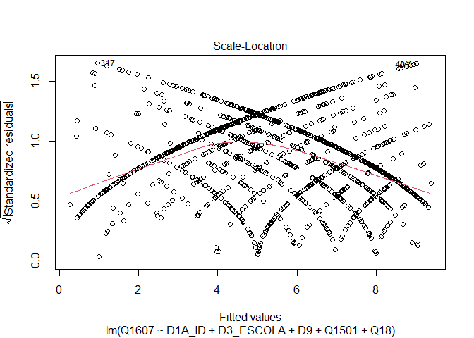
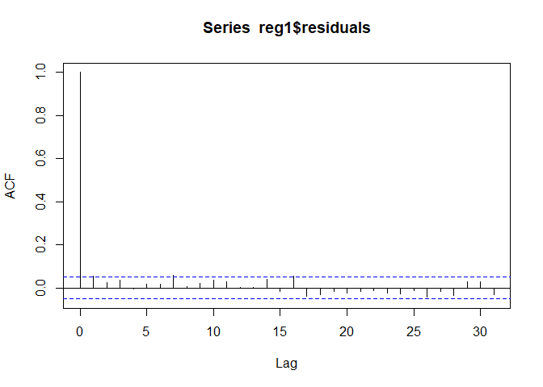

Exercício 7 - Análise de Dados
================
Felipe Lira Paiva

Carregando os pacotes, abrindo o banco…

``` r
library(tidyverse)
library(knitr)
library(haven)
library(readr)
library(readxl)
library(vcd)
library(scales)
library(graphics)
library(dotwhisker)
library(lmtest)
library(car)
library(MASS)


Baseatividade6 <- read_sav("C:/Users/Felipe/Desktop/Baseatividade6.sav")

View(Baseatividade6)
```

### Questão 1

No exercício anterior foram feitos alguns modelos bivariados. Agora faça
uma regressão multivariada mostrando como a nota atribuída a Jair
Bolsonaro (variável `Q1607`) pode ser explicada pelas variáveis idade
(`D1A_ID`), educação (`D3_ESCOLA`), renda (`D9`), nota atribuída ao PT
(`Q1501`) e auto-atribuição ideológica (`Q18`) dos respondentes.
Interprete o resultado a partir das informações dadas pelo sumário da
regressão.

``` r
atv7 <- Baseatividade6

atv7$Q1607 <- as.numeric(atv7$Q1607)

questao1 <- atv7 %>%
        filter(Q1607 <= 10,
               D9 < 9999998,
               Q1501 <= 10,
               Q18 <= 10)

reg1 <- lm(Q1607 ~ D1A_ID + D3_ESCOLA + D9 + Q1501 + Q18, data = questao1)
           
           
      summary(reg1)
```

    ## 
    ## Call:
    ## lm(formula = Q1607 ~ D1A_ID + D3_ESCOLA + D9 + Q1501 + Q18, data = questao1)
    ## 
    ## Residuals:
    ##     Min      1Q  Median      3Q     Max 
    ## -9.0176 -2.5841  0.4915  2.1784  9.0477 
    ## 
    ## Coefficients:
    ##               Estimate Std. Error t value Pr(>|t|)    
    ## (Intercept)  5.743e+00  4.768e-01  12.044  < 2e-16 ***
    ## D1A_ID       5.816e-03  6.216e-03   0.936  0.34968    
    ## D3_ESCOLA   -1.543e-01  4.469e-02  -3.453  0.00057 ***
    ## D9          -3.067e-05  2.793e-05  -1.098  0.27230    
    ## Q1501       -4.154e-01  2.359e-02 -17.608  < 2e-16 ***
    ## Q18          3.244e-01  2.627e-02  12.349  < 2e-16 ***
    ## ---
    ## Signif. codes:  0 '***' 0.001 '**' 0.01 '*' 0.05 '.' 0.1 ' ' 1
    ## 
    ## Residual standard error: 3.336 on 1456 degrees of freedom
    ## Multiple R-squared:  0.2831, Adjusted R-squared:  0.2806 
    ## F-statistic:   115 on 5 and 1456 DF,  p-value: < 2.2e-16

``` r
      confint(reg1)
```

    ##                     2.5 %        97.5 %
    ## (Intercept)  4.807218e+00  6.677845e+00
    ## D1A_ID      -6.378648e-03  1.800966e-02
    ## D3_ESCOLA   -2.419686e-01 -6.665908e-02
    ## D9          -8.546072e-05  2.411486e-05
    ## Q1501       -4.616620e-01 -3.691133e-01
    ## Q18          2.728670e-01  3.759211e-01

Resposta:

No modelo de regressão, observamos que as variáveis idade (`D1A_ID`) e
renda (`D9`) não são estatisticamente significativas, pelo p-valor ser
muito alto; as demais variáveis possuem um p-valor baixo. Quando a
escolaridade aumenta em uma unidade, a nota atribuída a Bolsonaro
diminui em 0,1543. Quando uma unidade é aumentada na nota do PT, a nota
de Bolsonaro é 0.415 menor. Quando a auto-atribuição ideológica é
aumentada em uma unidade, a nota de Bolsonaro é aumentada em 0.3244. O
valor do intercepto é 5,743. O R-quadrado é 0,28, o que significa que o
nosso modelo explica 28% da realidade. O R-quadrado ajustado, que “pune”
variáveis ruins, é de 0,28 (a diferença está nas outras casas decimais).
O nosso modelo erra, em média, 3,336 pontos. Também vimos os
coeficientes a partir do “confint”: podemos notar que as duas variáveis
de alto p-valor passam pelo zero, enquanto as demais não passam.

### Questão 2

Em que medida os resultados se mantém ou se alteram quando comparados
com os resultados do exercício anterior, quando foram utilizadas apenas
regressões bivariadas?

Resposta:

No exercício passado, deram significativos: Idade (coeficiente de
0,025), escolaridade (coeficiente de -0.118), nota atribuída ao PT
(-0.411) e auto-avaliação ideológica (0.409). Enquanto, a renda não deu
significativo. Portanto, de primeira, vemos que perdemos a significância
da idade em relação ao modelo anterior. Ademais, todas as relações
continuaram na mesma direção (o que era positivo, continuou positivo e
vice-versa). O R-quadrado também merece destaque, pois o modelo deste
exercício explica muito mais a realidade do que os modelos bivariados da
atividade anterior. O erro padrão é menor neste modelo em relação aos
modelos bivariados. Quanto aos valores dos coeficientes, a escolaridade,
antes, era -0,118 e, agora, é -0,1543 (pequena mudança), a nota
atribuída ao PT tinha coeficiente -0,411 e, agora, tem -0,4154 (ou
seja, quase nenhuma mudança) e a auto-avaliação ideológica era 0.409 e
foi para 0,3244 (maior mudança entre os coeficientes).

### Questão 3

A partir da exposição de gráficos e testes, avalie se o modelo se adequa
aos pressupostos que uma regressão linear exige.

``` r
plot(reg1, 1)
```

<!-- -->

``` r
plot(reg1, 3)
```

<!-- -->

``` r
bptest(reg1)
```

    ## 
    ##  studentized Breusch-Pagan test
    ## 
    ## data:  reg1
    ## BP = 57.067, df = 5, p-value = 4.898e-11

``` r
ncvTest(reg1) 
```

    ## Non-constant Variance Score Test 
    ## Variance formula: ~ fitted.values 
    ## Chisquare = 23.31391, Df = 1, p = 1.376e-06

``` r
acf(reg1$residuals)
```

<!-- -->

``` r
durbinWatsonTest(reg1)
```

    ##  lag Autocorrelation D-W Statistic p-value
    ##    1      0.05506583      1.887184   0.038
    ##  Alternative hypothesis: rho != 0

``` r
plot(reg1, 2)
```

<!-- -->

``` r
sresid <- studres(reg1) 
shapiro.test(sresid)
```

    ## 
    ##  Shapiro-Wilk normality test
    ## 
    ## data:  sresid
    ## W = 0.98814, p-value = 1.522e-09

Linearidade: idealmente, a linha vermelha deve ser horizontal à linha
pontilhada (que está bem no meio do gráfico), entretanto, observamos
algumas oscilações pequenas, especialmente nas pontas.

Homocedasticidade: Aqui, o importante é que os pontos estejam
distribuídos para cima, para baixo e ao longo do eixo x. Fizemos também
os dois testes; se nossa hipótese nula é que há homocedasticidade, o
resultado desejado é um p-valor alto, porém, observamos nos testes
p-valor extremamente baixos, indicando que o pressuposto da
homocedasticidade não está satisfeito.

Autocorrelação entre casos/resíduos: o resultado ideal é que todas as
linahs (com exceção da primeira) estejam dentro do tracejado azul. A
hipótese nula é que não existe correlação (portanto, esperamos um
p-valor alto). O p-valor do teste foi de 0.034, satisfazendo o
pressuposto.

Normalidade dos resíduos: aqui, o ideal é que os pontos estejam próximos
da linha diagonal, porém observamos que isso não acontece no “meio” e
nas pontas. A partir do teste de normalidade, também esperávamos que o
p-valor fosse alto para não rejeitar a hipótese nula, mas observamos que
ele é baixo, de forma que esse pressuposto não está sendo satisfeito.

### Questão 4

Considerando o 4o hurdle do livro *Fundamentals…*, faça um modelo de
regressão extra adicionando uma variável **numérica** que foi omitida do
modelo anterior, mas que possa ter relação causal com a variável
dependente (e talvez alguma associação com as independentes anteriores).
Justifique a variável extra e analise o resultado.

``` r
questao2 <- atv7 %>%
        filter(Q1607 <= 10,
               D9 < 9999998,
               Q1501 <= 10,
               Q18 <= 10,
               Q1505 <= 10)

reg2 <- lm(Q1607 ~ D1A_ID + D3_ESCOLA + D9 + Q1501 + Q18 + Q1505, data = questao2)
           
           
      summary(reg2)
```

    ## 
    ## Call:
    ## lm(formula = Q1607 ~ D1A_ID + D3_ESCOLA + D9 + Q1501 + Q18 + 
    ##     Q1505, data = questao2)
    ## 
    ## Residuals:
    ##      Min       1Q   Median       3Q      Max 
    ## -10.4560  -2.3735   0.2589   2.3373  10.2935 
    ## 
    ## Coefficients:
    ##               Estimate Std. Error t value Pr(>|t|)    
    ## (Intercept)  4.708e+00  5.059e-01   9.307  < 2e-16 ***
    ## D1A_ID       3.983e-03  6.495e-03   0.613  0.53981    
    ## D3_ESCOLA   -1.231e-01  4.623e-02  -2.664  0.00783 ** 
    ## D9          -1.145e-05  2.724e-05  -0.420  0.67441    
    ## Q1501       -4.469e-01  2.515e-02 -17.771  < 2e-16 ***
    ## Q18          3.255e-01  2.807e-02  11.595  < 2e-16 ***
    ## Q1505        2.669e-01  3.196e-02   8.352  < 2e-16 ***
    ## ---
    ## Signif. codes:  0 '***' 0.001 '**' 0.01 '*' 0.05 '.' 0.1 ' ' 1
    ## 
    ## Residual standard error: 3.196 on 1250 degrees of freedom
    ## Multiple R-squared:  0.3396, Adjusted R-squared:  0.3365 
    ## F-statistic: 107.1 on 6 and 1250 DF,  p-value: < 2.2e-16

``` r
      confint(reg2)
```

    ##                     2.5 %        97.5 %
    ## (Intercept)  3.715570e+00  5.700512e+00
    ## D1A_ID      -8.758946e-03  1.672502e-02
    ## D3_ESCOLA   -2.138347e-01 -3.244867e-02
    ## D9          -6.489607e-05  4.200012e-05
    ## Q1501       -4.961893e-01 -3.975253e-01
    ## Q18          2.703957e-01  3.805283e-01
    ## Q1505        2.042448e-01  3.296521e-01

Resposta:

A variável adicionada foi a avaliação ao PSDB. Bolsonaro foi eleito com
um discurso contra o petismo e, durante muitos anos, o partido que
protagonizou a cena política com o PT foi o PSDB. Porém, desde 2002, o
PSDB não obteve sucesso em derrotar o PT nas urnas (4 eleições
consecutivas). Assim, seria de se esperar que parte do eleitorado do
PSDB, movido pelo antipetismo, se aproximaria de Bolsonaro, candidato
com mais chances de derrotar o PT. O que se espera da regressão é,
portanto, uma relação positiva entre as variáveis.

Com o resultado da regressão, observamos que a nossa hipótese é
corroborada, ainda que o impacto seja pequeno. O p-valor é baixo e o
coeficiente é 0,2669 (ou seja, o aumento de uma unidade na nota
atribuída ao PSDB, aumenta em 0,2669 a avaliação a Bolsonaro). É
interessante notar que a significância estatística da escolaridade
diminuiu um pouco (mas o p-valor ainda é baixo), o erro padrão do modelo
também diminuiu um pouco, o R-quadrado aumentou em cerca de 5%, e o
intercepto diminuiu, ficando em 4,7.

### Questão 5

Compare o resultado obtido com o modelo e conclusões anteriores.

Resposta:

Uma das primeiras coisas que nos chama a atenção é a diminuição da
significância estatistica da escolaridade (mas o p-valor ainda é baixo e
significante a 0.001). A adição de apenas essa nova variável também
ajudou a melhorar o R-quadrado e o R-quadrado ajustado, que possuem,
respectivamente 33,96% e 33,65%. O valor do intercepto também merece ser
notado, pois diminuiu: antes era de 5.743 e agora está em 4.708. O erro
padrão também diminuiu, mas foi pouco: de 3.336 para 3196. É importante
notar que nossa amostra diminuiu um pouco, em aproximadamente 200 casos,
pois foram excluídos os casos que os respondentes não avaliaram o PSDB.
