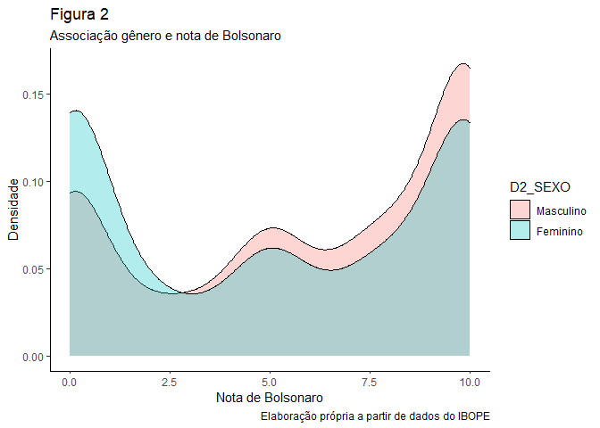
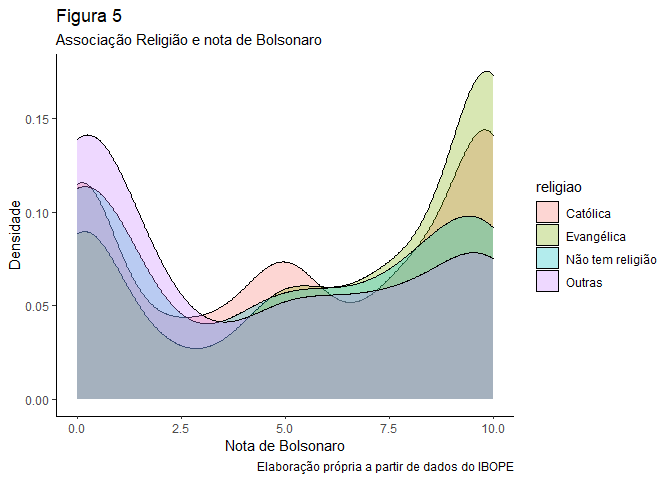

Exercício 8 - Análise de Dados
================
Felipe Lira Paiva

Continuaremos com a utilização dos dados do ESEB2018. Carregue o banco
da mesma forma que nos exercicios anteriores

``` r
library(tidyverse)
library(knitr)
library(haven)
library(readr)
library(readxl)
library(vcd)
library(scales)
library(graphics)
library(dotwhisker)
library(lmtest)
library(car)
library(MASS)

link <- "https://github.com/MartinsRodrigo/Analise-de-dados/blob/master/04622.sav?raw=true"

download.file(link, "04622.sav", mode = "wb")

banco <- read_spss("04622.sav") 

banco <- banco %>%
  mutate(D2_SEXO = as_factor(D2_SEXO),
         D10 = as_factor(D10)) %>%
  filter(Q1607 < 11)
```

### Questão 1

Começaremos a utilizar no modelo de regressão variáveis
qualitativas/categóricas. A primeira delas é sexo (D2\_SEXO). Represente
esta variável graficamente.

``` r
      ggplot(banco, aes(D2_SEXO))+
      geom_bar()+
      theme_classic()+
  labs(title = "Figura 1",
             subtitle = "Gráfico de gênero",
             x = "Gênero", 
             y = "Número de pessoas",
             caption = "Elaboração própria a partir de dados do IBOPE")
```

<!-- -->

Resposta:

No gráfico acima, observamos que a frequência de homens e mulheres se
aproxima bastante, com o número de mulheres sendo levemente maior que o
de homens.

### Questão 2

Represente graficamente a associação entre sexo e nota atribuida a
Bolsonaro (Q1607)

``` r
      ggplot(banco, aes(Q1607, fill = D2_SEXO)) +
      geom_density(alpha = 0.3)+
      theme_classic()+
      labs(title = "Figura 2",
             subtitle = "Associação gênero e nota de Bolsonaro",
             x = "Nota de Bolsonaro", 
             y = "Densidade",
             caption = "Elaboração própria a partir de dados do IBOPE")
```

<!-- -->

``` r
      ggplot(banco, aes(D2_SEXO, Q1607)) +
      geom_boxplot()+
      theme_classic()+
      labs(title = "Figura 3",
             subtitle = "Associação gênero e nota de Bolsonaro",
             x = "Gênero", 
             y = "Nota de Bolsonaro",
             caption = "Elaboração própria a partir de dados do IBOPE")
```

<!-- -->

Resposta:

Os dois gráficos acima permitem observar a relação entre a avaliação a
Bolsonaro e o gênero. No primeiro, é bastante claro os dois picos que
observamos: os homens (rosa) têm uma frequência maior de avaliação
positiva a ele, enquanto as mulheres (azul) tem uma frequência maior na
avaliação negativa (sobretudo entre 0 e 2.5). No boxplot, é interessante
perceber que o primeiro quartil das mulheres está no 0 (ou muito
próximo), enquanto o dos homens está acima de 2.5. Isso significa que
não há muitas avaliações negativas de Bolsonaro dos homens. Notemos
também que a mediana dos homens é levemente superior à mediana das
mulheres.

### Questão 3

Teste a associação entre sexo e aprovação de Bolsonaro. Qual é sua
conclusão?

``` r
t.test(Q1607 ~ D2_SEXO, data = banco)
```

    ## 
    ##  Welch Two Sample t-test
    ## 
    ## data:  Q1607 by D2_SEXO
    ## t = 5.88, df = 2324, p-value = 4.693e-09
    ## alternative hypothesis: true difference in means is not equal to 0
    ## 95 percent confidence interval:
    ##  0.6392909 1.2790608
    ## sample estimates:
    ## mean in group Masculino  mean in group Feminino 
    ##                6.020536                5.061360

Resposta:

A partir do teste-t, vemos que o p-valor é extremamente baixo e a
diferença entre as médias é de aproximadamente um ponto. Para os homens,
está em 6.02 e para as mulheres está em 5.06. Ou seja, há uma diferença
entre as médias (de um 1 ponto, numa escala que vai de 0 a 10) e esta
diferença é estatisticamente significante. Outra forma de olhar é ver o
intervalo de confiança: ele não passa pelo zero, se ele passasse, nós
poderíamos afirmar que não há diferença com significância estatística.

### Questão 4

Faça uma regressão bivariada com estas duas variáveis, verificando em
que medida sexo explica a nota atribuida a Bolsonaro. Interprete o
resultado da regressão (o \(\beta\), o \(\alpha\), p-valores e medidas
de desempenho do modelo)

``` r
reg1 <- lm(Q1607 ~ D2_SEXO, data = banco)
           
      summary(reg1)
```

    ## 
    ## Call:
    ## lm(formula = Q1607 ~ D2_SEXO, data = banco)
    ## 
    ## Residuals:
    ##     Min      1Q  Median      3Q     Max 
    ## -6.0205 -4.0614 -0.0205  3.9795  4.9386 
    ## 
    ## Coefficients:
    ##                 Estimate Std. Error t value Pr(>|t|)    
    ## (Intercept)       6.0205     0.1178  51.112  < 2e-16 ***
    ## D2_SEXOFeminino  -0.9592     0.1636  -5.863 5.18e-09 ***
    ## ---
    ## Signif. codes:  0 '***' 0.001 '**' 0.01 '*' 0.05 '.' 0.1 ' ' 1
    ## 
    ## Residual standard error: 3.942 on 2324 degrees of freedom
    ## Multiple R-squared:  0.01458,    Adjusted R-squared:  0.01415 
    ## F-statistic: 34.38 on 1 and 2324 DF,  p-value: 5.178e-09

``` r
      confint(reg1)
```

    ##                     2.5 %     97.5 %
    ## (Intercept)      5.789550  6.2515214
    ## D2_SEXOFeminino -1.279962 -0.6383893

Resposta:

O p-valor é baixo, então podemos dizer que a variável é estatisticamente
significante. O coeficiente D2\_SEXOFeminino de -0.9592 quer dizer que
ser mulher diminui, em média, 0.9592 pontos na avaliação de Bolsonaro. O
intercepto foi de 6.02. O erro padrão é de 3.924, o R-quadrado e o
R-quadrado ajustado estão bastante próximos em 0.014 (1.4%) de
explicação da realidade. Ou seja é significativo, mas não explica
muito da realidade. No intervalo de confiança, vemos que ele não passa
pelo zero.

### Questão 5

Outra variável categórica bastante presente no debate sobre voto na
última eleição é religião (D10). Represente esta variável graficamente.

``` r
      ggplot(banco, aes(, D10))+
      geom_bar()+
      theme_classic()+
  labs(title = "Figura 4",
             subtitle = "Gráfico de religião",
             y = "Religião", 
             x = "Número de pessoas",
             caption = "Elaboração própria a partir de dados do IBOPE")
```

<!-- -->

Resposta:

O gráfico acima permite ver a frequência das religiões. É bem evidente
que as religiões Católica e Evangélica são as duas com maior frequência,
seguidas pelas pessoas sem religião e, depois, espíritas e ateus.

### Questão 6

Crie no banco de dados uma variável de religião modificada chamada
`religiao` com as categorias “Evangélica”, “Católica”, “Não tem
religião”, e agregue todas as outras na categoria “Outras”.

``` r
Outras <- levels(banco$D10)[-c(3,5,13)]

banco <- banco %>%
  mutate(religiao = case_when(D10 %in% Outras ~ "Outras",
                              D10 == "Católica" ~ "Católica",
                              D10 == "Evangélica" ~ "Evangélica",
                              D10 == "Não tem religião" ~ "Não tem religião"))


ggplot(banco, aes(religiao, ..count../sum(..count..) )) +
  geom_bar() +
  scale_y_continuous(labels = percent)
```

<!-- -->

### Questão 7

Represente graficamente a associação entre religiao e nota atribuida a
Bolsonaro

``` r
      ggplot(banco, aes(Q1607, fill = religiao)) +
      geom_density(alpha = 0.3)+
      theme_classic()+
      labs(title = "Figura 5",
             subtitle = "Associação Religião e nota de Bolsonaro",
             x = "Nota de Bolsonaro", 
             y = "Densidade",
             caption = "Elaboração própria a partir de dados do IBOPE")
```

<!-- -->

``` r
      ggplot(banco, aes(religiao, Q1607)) +
      geom_boxplot()+
      theme_classic()+
      labs(title = "Figura 6",
             subtitle = "Associação Religião e nota de Bolsonaro",
             x = "Religião", 
             y = "Nota de Bolsonaro",
             caption = "Elaboração própria a partir de dados do IBOPE")
```

<!-- -->

Respostas:

Algo bastante nítido em ambos os gráficos é a alta nota dada pelos
evangélicos: podemos ver que possui a maior mediana no boxplot e a
maior frequência no gráfico de densidade para o valor 10 (e a menor
frequência para o valor 0). A mediana dos católicos e dos sem religião
parecem bem próximas, seria necessário ver os valores numéricos para
dizer qual é maior. “Outras” tem a menor mediana.

### Questão 8

Para fazer o teste estatistico da associação entre as variáveis, não
podemos usar o teste-t pois neste caso a variável categórica possui
diversos níveis. O adequado é utilizar o teste de ANOVA ou o teste de
Kruskal. Abaixo ilustramos como fazer esse teste. O Kruskal-test indica
se há diferença entre alguma das categorias da variável e a variável
contínua, mas não especifica como as diferentes categorias se
diferenciam. Isso pode ser obtido com o teste de Wilcox, que compara os
agrupamentos par a par. Como você interpreta esse resultado?

``` r
kruskal.test(Q1607 ~ religiao, data = banco)
```

    ## 
    ##  Kruskal-Wallis rank sum test
    ## 
    ## data:  Q1607 by religiao
    ## Kruskal-Wallis chi-squared = 61.013, df = 3, p-value = 3.571e-13

``` r
pairwise.wilcox.test(banco$Q1607, banco$religiao,
                     p.adjust.method = "BH")
```

    ## 
    ##  Pairwise comparisons using Wilcoxon rank sum test with continuity correction 
    ## 
    ## data:  banco$Q1607 and banco$religiao 
    ## 
    ##                  Católica Evangélica Não tem religião
    ## Evangélica       7.4e-06  -          -               
    ## Não tem religião 0.043    8.3e-06    -               
    ## Outras           1.2e-05  4.4e-11    0.126           
    ## 
    ## P value adjustment method: BH

Resposta:

O primeiro teste, Kruskal-test, indica se há diferença entre alguma das
categorias. O p-valor é extremamente baixo, o que permite rejeitar a
hipótese nula (que não há diferença entre as categorias em relação ao
apreço a Bolsonaro). Entretanto, esse teste não permite saber como é a
diferença entre as categorias.

Com o segundo teste, vemos que o único p-valor alto (maior que 0.05) é o
entre os grupos “Outras religiões” e “Não tem religião”; importante
notar que o p-valor de “Católicos” e “Não tem religião” é quase 0.05,
mas ainda é significativo sim. Todos os outros p-valores são
extremamente baixos, ou seja, há uma diferença entre os grupos com
significância estatística.

### Questão 9

Faça uma regressão linear para verificar em que medida religião explica
a avaliação de Bolsonaro. Interprete o resultado da regressão (cada um
dos \(\beta\)s, o \(\alpha\), p-valores e medidas de desempenho do
modelo)

``` r
reg2 <- lm(Q1607 ~ religiao, data = banco)
           
      summary(reg2)
```

    ## 
    ## Call:
    ## lm(formula = Q1607 ~ religiao, data = banco)
    ## 
    ## Residuals:
    ##    Min     1Q Median     3Q    Max 
    ## -6.259 -4.107  0.559  3.741  5.893 
    ## 
    ## Coefficients:
    ##                          Estimate Std. Error t value Pr(>|t|)    
    ## (Intercept)                5.4410     0.1146  47.470  < 2e-16 ***
    ## religiaoEvangélica         0.8184     0.1838   4.452 8.93e-06 ***
    ## religiaoNão tem religião  -0.6325     0.3081  -2.053   0.0402 *  
    ## religiaoOutras            -1.3339     0.2859  -4.665 3.26e-06 ***
    ## ---
    ## Signif. codes:  0 '***' 0.001 '**' 0.01 '*' 0.05 '.' 0.1 ' ' 1
    ## 
    ## Residual standard error: 3.921 on 2322 degrees of freedom
    ## Multiple R-squared:  0.0261, Adjusted R-squared:  0.02484 
    ## F-statistic: 20.74 on 3 and 2322 DF,  p-value: 2.936e-13

``` r
      confint(reg2)
```

    ##                               2.5 %      97.5 %
    ## (Intercept)               5.2162572  5.66579408
    ## religiaoEvangélica        0.4578709  1.17889504
    ## religiaoNão tem religião -1.2366115 -0.02841855
    ## religiaoOutras           -1.8945985 -0.77316710

Resposta:

Todos os p-valores foram significantes para as religiões em relação à
religião católica. Ser evangélico aumenta a avaliação de Bolsonaro em
0.8184, não ter religião diminui em 0.6325 e o de outras religiões
diminui em 1.3339. O intercepto é de 5.4410. O erro padrão foi de 3.921.
O R-quadrado e o R-quadrado ajustado foram, respectivamente, 0.026 e
0.024, ou seja, o modelo explica perto de 2% da realidade, o que é muito
pouco. Nenhum coeficiente passa pelo 0 no intervalo de confiança.

### Questão 10

Faça uma regressao linear avaliando ao mesmo tempo em que medida
religiao e sexo explicam a avaliacao de Bolsonaro. Interprete o
resultado de cada um dos coeficientes a partir da representação gráfica
destes.

``` r
reg3 <- lm(Q1607 ~ D2_SEXO + religiao, data = banco)
           
      summary(reg3)
```

    ## 
    ## Call:
    ## lm(formula = Q1607 ~ D2_SEXO + religiao, data = banco)
    ## 
    ## Residuals:
    ##     Min      1Q  Median      3Q     Max 
    ## -6.8130 -3.9448  0.1915  3.7365  6.3682 
    ## 
    ## Coefficients:
    ##                          Estimate Std. Error t value Pr(>|t|)    
    ## (Intercept)                5.9493     0.1401  42.477  < 2e-16 ***
    ## D2_SEXOFeminino           -1.0045     0.1616  -6.215 6.07e-10 ***
    ## religiaoEvangélica         0.8637     0.1825   4.732 2.36e-06 ***
    ## religiaoNão tem religião  -0.6813     0.3057  -2.229   0.0259 *  
    ## religiaoOutras            -1.3130     0.2837  -4.629 3.88e-06 ***
    ## ---
    ## Signif. codes:  0 '***' 0.001 '**' 0.01 '*' 0.05 '.' 0.1 ' ' 1
    ## 
    ## Residual standard error: 3.889 on 2321 degrees of freedom
    ## Multiple R-squared:  0.04204,    Adjusted R-squared:  0.04039 
    ## F-statistic: 25.46 on 4 and 2321 DF,  p-value: < 2.2e-16

``` r
      confint(reg3)
```

    ##                               2.5 %      97.5 %
    ## (Intercept)               5.6746301  6.22393694
    ## D2_SEXOFeminino          -1.3214476 -0.68754476
    ## religiaoEvangélica        0.5057662  1.22158996
    ## religiaoNão tem religião -1.2807278 -0.08181084
    ## religiaoOutras           -1.8692530 -0.75671984

``` r
dwplot(reg3,
vline = geom_vline(xintercept = 0, colour = "grey60", linetype = 2))
```

<!-- -->

Respostas:

Não houve grandes mudanças. Os coeficientes ainda estão significativos
para um p-valor menor que 0.05. Como era esperado, as direções
continuaram (positivo e negativo) e os coeficientes só tiveram pequenas
mudanças, ficando agora: -1 (mulheres), 0.86 (evangélicos), -0.68 (não
tem religião), -1.31 (outras religiões). O modelo ainda erra bastante
(erro padrão 3.889) e o R-quadrado e o R-quadrado ajustado são,
respectivamente, 0.042 e 0.040, ou seja, o nosso modelo explica cerca de
4% da variação. Nos intervalos de confiança, vemos que nenhum passa pelo
zero, o que fica bastante claro no gráfico (dwplot), pois vemos que as
linhas dos coeficientes nunca cruzam a linha tracejada do zero.
