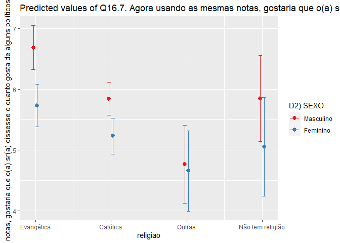

Exercicio 9 - Análise de Dados
================
Felipe Lira Paiva

Continuaremos com a utilização dos dados do ESEB2018. Carregue o banco
da mesma forma que nos exercicios anteriores

``` r
library(tidyverse)
library(haven)
library(scales)
library(dotwhisker)
library(lmtest)
library(car)
library(MASS)
library(knitr)
library(stargazer)
library(sjPlot)

banco <- read_spss("04622.sav") 

banco <- banco %>%
  mutate(D10 = as_factor(D10)) %>%
  filter(Q1607 < 11, 
         Q18 < 11,
         D9 < 9999998,
         Q1501 < 11)
```

Crie a mesma variável de religião utilizada no exercício anterior

``` r
Outras <- levels(banco$D10)[-c(3,5,13)]

banco <- banco %>%
  mutate(religiao = case_when(D10 %in% Outras ~ "Outras",
                              D10 == "Católica" ~ "Católica",
                              D10 == "Evangélica" ~ "Evangélica",
                              D10 == "Não tem religião" ~ "Não tem religião"))


ggplot(banco, aes(religiao, ..count../sum(..count..) )) +
  geom_bar() +
  scale_y_continuous(labels = percent)
```

<!-- -->

### Questão 1

Faça uma regressão linear avaliando em que medida as variáveis
independentes utilizadas nos exercícios 7 e 8, idade(D1A\_ID), educação
(D3\_ESCOLA), renda (D9), nota atribuída ao PT (Q1501), auto-atribuição
ideológica (Q18), sexo (D2\_SEXO) e religião (variável criada no passo
anterior) explicam a avaliação de Bolsonaro (Q1607), mas com uma
interação entre as variáveis religião e sexo. Exiba o resultado da
regressão e interprete os valores dos coeficientes \(\beta\)s estimados.

``` r
regressao <- lm (Q1607 ~ D1A_ID + D3_ESCOLA + D9 + Q1501 + Q18 + D2_SEXO + religiao + D2_SEXO * religiao, data = banco )

summary(regressao)
```

    ## 
    ## Call:
    ## lm(formula = Q1607 ~ D1A_ID + D3_ESCOLA + D9 + Q1501 + Q18 + 
    ##     D2_SEXO + religiao + D2_SEXO * religiao, data = banco)
    ## 
    ## Residuals:
    ##    Min     1Q Median     3Q    Max 
    ## -8.942 -2.561  0.361  2.303  9.052 
    ## 
    ## Coefficients:
    ##                                    Estimate Std. Error t value Pr(>|t|)    
    ## (Intercept)                       6.114e+00  5.915e-01  10.338   <2e-16 ***
    ## D1A_ID                            1.065e-02  6.255e-03   1.703   0.0888 .  
    ## D3_ESCOLA                        -1.134e-01  4.491e-02  -2.524   0.0117 *  
    ## D9                               -3.632e-05  2.768e-05  -1.312   0.1897    
    ## Q1501                            -3.956e-01  2.370e-02 -16.696   <2e-16 ***
    ## Q18                               3.150e-01  2.607e-02  12.083   <2e-16 ***
    ## D2_SEXO                          -6.115e-01  2.438e-01  -2.508   0.0122 *  
    ## religiaoEvangélica                1.181e+00  6.146e-01   1.921   0.0549 .  
    ## religiaoNão tem religião          1.986e-01  1.059e+00   0.188   0.8512    
    ## religiaoOutras                   -1.583e+00  9.503e-01  -1.666   0.0960 .  
    ## D2_SEXO:religiaoEvangélica       -3.412e-01  3.895e-01  -0.876   0.3812    
    ## D2_SEXO:religiaoNão tem religião -1.889e-01  6.979e-01  -0.271   0.7867    
    ## D2_SEXO:religiaoOutras            5.041e-01  6.067e-01   0.831   0.4062    
    ## ---
    ## Signif. codes:  0 '***' 0.001 '**' 0.01 '*' 0.05 '.' 0.1 ' ' 1
    ## 
    ## Residual standard error: 3.297 on 1449 degrees of freedom
    ## Multiple R-squared:  0.3028, Adjusted R-squared:  0.297 
    ## F-statistic: 52.44 on 12 and 1449 DF,  p-value: < 2.2e-16

RESPOSTA:

Começando pelo intercepto: o seu valor é de 6.114 e seu p-valor é baixo
(ou seja, é significativo). Quanto às medidas do modelo: o erro padrão é
3.297 (o que o modelo erra em média), o R-quadrado é de 0.30 e o
R-quadrado ajustado de 0.297 (ou seja, o modelo explica 29,7% da
variação da realidade).

A variável de idade (`D1A_ID`) tem um beta de 0.01065, mas não é
significativa para um p-valor menor que 0.05 (p valor = 0.0888). A
variável de escolaridade (`D3_ESCOLA`) é significativa (p-valor =
0.0117) e tem um beta de -0.1134, isso significa que a cada aumento na
escolaridade, a aprovação a Bolsonaro diminui, em média 0.1134. A
variável de renda (`D9`) tem um beta -0,00003632, mas não é
significativa (p-valor 0.1897). A variável da nota atribuída ao PT
(`Q1501`) é significativa (p-valor muito baixo) e tem coeficiente de
-0.3956: ou seja, a cada uma unidade de nota maior que o respondente
atribuiu ao PT, a avaliação de Bolsonaro diminui, em média 0.3956. A
variável de auto-avaliação ideológica (`Q18`) é signifcativa (p-valor
muito baixo) e tem um beta de 3.15, o que singifica que a cada aumento
na escala ideológica, para a direita (valor maior), a pessoa aumenta, em
média, 3.15 pontos na avaliação de Bolsonaro.

Agora, vamos falar dos coeficientes das variáveis que possuem a
interseção, pois a interpretação tem um detalhe.

Ignorando todos os outros coeficientes, é como se a nota de Bolsonaro
fosse dada pela equação:

Nota Bolsonaro = Alfa + Gênero + religião + gênero \* religião

Na variável de gênero (`D2_SEXO`), o gênero que está aparecendo é o
feminino (lembramos que há uma relação negativa entre ser mulher e
apoiar Bolsonaro, como vimos no exercício passado) e a religião que não
está aparecendo é a católica; então ser mulher e católica diminui, em
média, o apoio a Bolsonaro em 0.6115 (p-valor 0.0122). Por que
católica? Porque é o “0” em religião.

Nas religiões, nenhuma variável foi significativa (todos os p-valores
foram maiores que 0.05). Sendo evangélico e homem, o beta é positivo e
de 1.181. Não tendo religião e sendo homem, o beta é positivo e de
0.1986. Tendo outra religião e sendo homem, o beta é negativo e de
1.583.

Sendo mulher e tendo religião evangélica, o beta é negativo e de 0.3412.
Sendo mulher e não tendo religião, o beta é negativo e de 0.1889. Sendo
mulher e tendo outra religião, o beta é negativo e de 0.5041.

``` r
stargazer(regressao,
          type='html')
```

<table style="text-align:center">

<tr>

<td colspan="2" style="border-bottom: 1px solid black">

</td>

</tr>

<tr>

<td style="text-align:left">

</td>

<td>

<em>Dependent variable:</em>

</td>

</tr>

<tr>

<td>

</td>

<td colspan="1" style="border-bottom: 1px solid black">

</td>

</tr>

<tr>

<td style="text-align:left">

</td>

<td>

Q1607

</td>

</tr>

<tr>

<td colspan="2" style="border-bottom: 1px solid black">

</td>

</tr>

<tr>

<td style="text-align:left">

D1A\_ID

</td>

<td>

0.011<sup>\*</sup>

</td>

</tr>

<tr>

<td style="text-align:left">

</td>

<td>

(0.006)

</td>

</tr>

<tr>

<td style="text-align:left">

</td>

<td>

</td>

</tr>

<tr>

<td style="text-align:left">

D3\_ESCOLA

</td>

<td>

\-0.113<sup>\*\*</sup>

</td>

</tr>

<tr>

<td style="text-align:left">

</td>

<td>

(0.045)

</td>

</tr>

<tr>

<td style="text-align:left">

</td>

<td>

</td>

</tr>

<tr>

<td style="text-align:left">

D9

</td>

<td>

\-0.00004

</td>

</tr>

<tr>

<td style="text-align:left">

</td>

<td>

(0.00003)

</td>

</tr>

<tr>

<td style="text-align:left">

</td>

<td>

</td>

</tr>

<tr>

<td style="text-align:left">

Q1501

</td>

<td>

\-0.396<sup>\*\*\*</sup>

</td>

</tr>

<tr>

<td style="text-align:left">

</td>

<td>

(0.024)

</td>

</tr>

<tr>

<td style="text-align:left">

</td>

<td>

</td>

</tr>

<tr>

<td style="text-align:left">

Q18

</td>

<td>

0.315<sup>\*\*\*</sup>

</td>

</tr>

<tr>

<td style="text-align:left">

</td>

<td>

(0.026)

</td>

</tr>

<tr>

<td style="text-align:left">

</td>

<td>

</td>

</tr>

<tr>

<td style="text-align:left">

D2\_SEXO

</td>

<td>

\-0.611<sup>\*\*</sup>

</td>

</tr>

<tr>

<td style="text-align:left">

</td>

<td>

(0.244)

</td>

</tr>

<tr>

<td style="text-align:left">

</td>

<td>

</td>

</tr>

<tr>

<td style="text-align:left">

religiaoEvangélica

</td>

<td>

1.181<sup>\*</sup>

</td>

</tr>

<tr>

<td style="text-align:left">

</td>

<td>

(0.615)

</td>

</tr>

<tr>

<td style="text-align:left">

</td>

<td>

</td>

</tr>

<tr>

<td style="text-align:left">

religiaoNão tem religião

</td>

<td>

0.199

</td>

</tr>

<tr>

<td style="text-align:left">

</td>

<td>

(1.059)

</td>

</tr>

<tr>

<td style="text-align:left">

</td>

<td>

</td>

</tr>

<tr>

<td style="text-align:left">

religiaoOutras

</td>

<td>

\-1.583<sup>\*</sup>

</td>

</tr>

<tr>

<td style="text-align:left">

</td>

<td>

(0.950)

</td>

</tr>

<tr>

<td style="text-align:left">

</td>

<td>

</td>

</tr>

<tr>

<td style="text-align:left">

D2\_SEXO:religiaoEvangélica

</td>

<td>

\-0.341

</td>

</tr>

<tr>

<td style="text-align:left">

</td>

<td>

(0.390)

</td>

</tr>

<tr>

<td style="text-align:left">

</td>

<td>

</td>

</tr>

<tr>

<td style="text-align:left">

D2\_SEXO:religiaoNão tem religião

</td>

<td>

\-0.189

</td>

</tr>

<tr>

<td style="text-align:left">

</td>

<td>

(0.698)

</td>

</tr>

<tr>

<td style="text-align:left">

</td>

<td>

</td>

</tr>

<tr>

<td style="text-align:left">

D2\_SEXO:religiaoOutras

</td>

<td>

0.504

</td>

</tr>

<tr>

<td style="text-align:left">

</td>

<td>

(0.607)

</td>

</tr>

<tr>

<td style="text-align:left">

</td>

<td>

</td>

</tr>

<tr>

<td style="text-align:left">

Constant

</td>

<td>

6.114<sup>\*\*\*</sup>

</td>

</tr>

<tr>

<td style="text-align:left">

</td>

<td>

(0.591)

</td>

</tr>

<tr>

<td style="text-align:left">

</td>

<td>

</td>

</tr>

<tr>

<td colspan="2" style="border-bottom: 1px solid black">

</td>

</tr>

<tr>

<td style="text-align:left">

Observations

</td>

<td>

1,462

</td>

</tr>

<tr>

<td style="text-align:left">

R<sup>2</sup>

</td>

<td>

0.303

</td>

</tr>

<tr>

<td style="text-align:left">

Adjusted R<sup>2</sup>

</td>

<td>

0.297

</td>

</tr>

<tr>

<td style="text-align:left">

Residual Std. Error

</td>

<td>

3.297 (df = 1449)

</td>

</tr>

<tr>

<td style="text-align:left">

F Statistic

</td>

<td>

52.439<sup>\*\*\*</sup> (df = 12; 1449)

</td>

</tr>

<tr>

<td colspan="2" style="border-bottom: 1px solid black">

</td>

</tr>

<tr>

<td style="text-align:left">

<em>Note:</em>

</td>

<td style="text-align:right">

<sup>*</sup>p\<0.1; <sup>**</sup>p\<0.05; <sup>***</sup>p\<0.01

</td>

</tr>

</table>

### Questão 2

Interprete a significancia estatística dos coeficientes estimados

``` r
dwplot(regressao,
vline = geom_vline(xintercept = 0, colour = "grey60", linetype = 2))+
  theme_classic()
```

<!-- -->

RESPOSTA:

Em relação às primeiras variáveis (as sem interseção), falamos bastante
sobre no quesito anterior e vimos o p-valor. Aqui, temos nossas
observações corroboradas: Idade e Renda não são significativos (estão
tocando na linha tracejada), escolaridade é significativo, assim como a
nota atribuída ao PT e auto-avaliação ideológica.

Ao observar a variável de gênero, vemos que também é significativa e
está do lado esquerdo, evidenciando a relação negativa. Se a referência
fossem as mulheres (e, no resultado, aparecessem os homens), nós
veríamos a variável do outro lado, exatamente “oposta” à posição em que
ela se encontra agora.

Em relação às outras, vemos que evangélica é a que menos toca na linha
(lembrando que o p-valor é 0.549), mas, ainda assim, não é
significativa. As outras tocam claramente a linha, algumas com um grande
comprimento.

### Questão 3

Faça um gráfico que mostre a interação entre as duas variáveis.
Interprete o resultado apresentado

``` r
plot_model(regressao, type = "pred", 
           terms = c("religiao","D2_SEXO"), 
           ci.lvl = 0.9)
```

<!-- -->

``` r
plot_model(regressao, type = "pred", 
           terms = c("religiao","D2_SEXO"), 
           ci.lvl = 0.95)
```

<!-- -->

RESPOSTA:

Aqui, precisamos olhar se os intervalos se sobrepõe. Nitidamente, vemos
que, para a religião evangélica, há uma diferença entre ser homem e ser
mulher (os intervalos não se sobrepõem). Quanto os católicos, há uma
sobreposição pequena para o intervalo de confiança de 95%, mas não há
para 90%; mas, por ser muito pequena, podemos dizer que há sim uma
diferença entre ser homem e ser mulher. Em “Outras religiões”, vemos que
os intervalos se sobrepõem bastante (seja a 90% ou a 95%), de modo que
não há diferença entre ser homem ou mulher, quando se tem outra
religião. Por fim, entre as pessoas sem religião, a sobreposição ocorre
em quase metade do intervalo, como estão muito sobrepostos, afirmo que
não há diferença entre ser homem ou mulher, quando se não tem religião.
